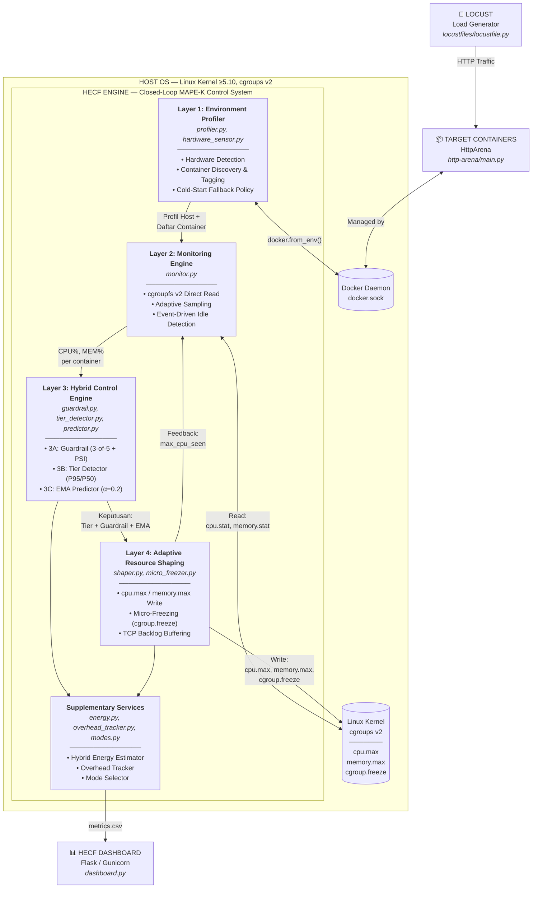

# Diagram Konsep Besar — HECF MAPE-K Closed-Loop Control

> **Kategori:** Inovasi Algoritma (S2)
> **Sumber:** `framework/main.py` (kontrol loop utama yang menyatukan semua layer)

Diagram ini menunjukkan bagaimana HECF beroperasi sebagai **sistem kontrol tertutup (Closed-Loop / MAPE-K)**: Monitor → Analyze → Plan → Execute → Kembali ke Monitor.

## Penjelasan Alur MAPE-K

| Fase MAPE-K | Layer | Fungsi |
|---|---|---|
| **Monitor** | Layer 1 + Layer 2 | Deteksi hardware, discover container, baca metrik CPU/MEM dari cgroupfs |
| **Analyze** | Layer 3B + 3C | Klasifikasi volatilitas (P95/P50), prediksi tren (EMA) |
| **Plan** | Layer 3A | Guardrail menentukan apakah perlu intervensi darurat |
| **Execute** | Layer 4 | Tulis parameter cgroups (cpu.max, memory.max, cgroup.freeze) |
| **Knowledge** | Supplementary | Estimasi energi, overhead tracking, mode selector |
