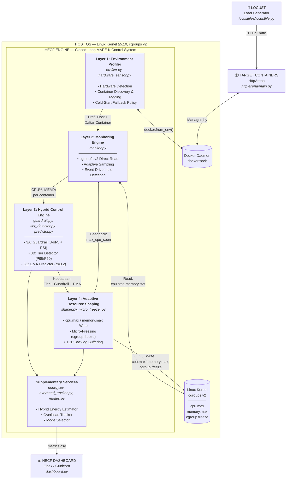
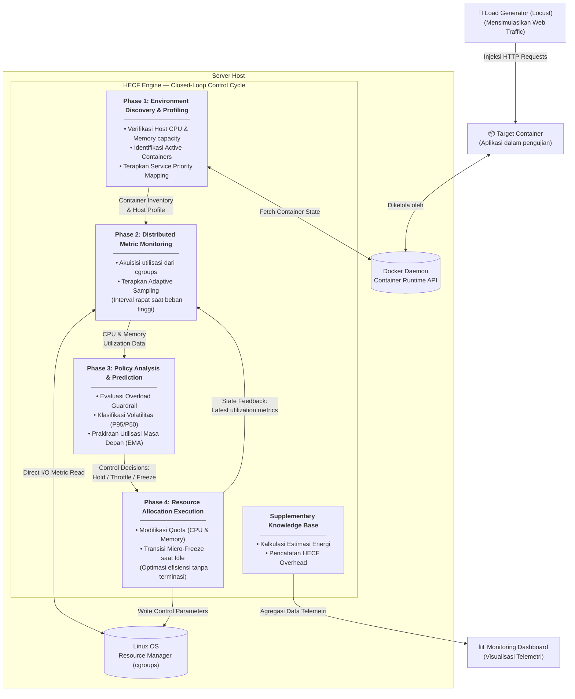

# Diagram Konsep Besar — HECF MAPE-K Closed-Loop Control

> **Kategori:** Inovasi Algoritma (S2)
> **Sumber:** `framework/main.py` (kontrol loop utama yang menyatukan semua layer)

Diagram ini menunjukkan bagaimana HECF beroperasi sebagai **sistem kontrol tertutup (Closed-Loop / MAPE-K)**: Monitor → Analyze → Plan → Execute → Kembali ke Monitor.

## Penjelasan Alur MAPE-K

| Fase MAPE-K | Layer | Fungsi |
| --- | --- | --- |
| **Monitor** | Layer 1 + Layer 2 | Deteksi hardware, discover container, baca metrik CPU/MEM dari cgroupfs |
| **Analyze** | Layer 3B + 3C | Klasifikasi volatilitas (P95/P50), prediksi tren (EMA) |
| **Plan** | Layer 3A | Guardrail menentukan apakah perlu intervensi darurat |
| **Execute** | Layer 4 | Tulis parameter cgroups (cpu.max, memory.max, cgroup.freeze) |
| **Knowledge** | Supplementary | Estimasi energi, overhead tracking, mode selector |

---

## Alur Logika Konseptual

---

## 🗂️ Pemetaan Konsep ke File Kode (Daftar Isi Algoritma)

File ini berfungsi sebagai **Master Daftar Isi**. Berikut adalah penjelasan bagaimana setiap blok konseptual di atas diwujudkan dalam file *codingan* (Python) yang ada di dalam folder `framework/`:

### 1. File Utama (Orkestrator)
*   **`framework/main.py`**
    *   **Peran:** Jantung dari sistem HECF. File ini berisi loop utama (baris 270+) yang terus menerus berjalan mengeksekusi siklus MAPE-K untuk setiap kontainer.
    *   **Interaksi:** Memanggil fungsi-fungsi dari Layer 1, 2, 3, dan 4 secara berurutan. Ini adalah file yang menyambungkan seluruh algoritma.

### 2. Layer 1: Environment Profiler (Monitor - Awal)
*   **`framework/profiler.py`**: Bertugas mencari kontainer mana saja yang sedang berjalan menggunakan Docker API (`docker.from_env()`). Mengidentifikasi target yang harus dikelola.
*   **`framework/hardware_sensor.py`**: Membaca sensor daya (RAPL) dari perangkat keras Linux.

### 3. Layer 2: Monitoring Engine (Monitor - Lanjutan)
*   **`framework/monitor.py`**: Bertugas terjun langsung membaca _virtual file_ cgroups (`/sys/fs/cgroup/...`) untuk mendapatkan data CPU dan Memory penggunaan dari tiap kontainer secara instan tanpa delay. Data metrik ini kemudian diserahkan ke Layer 3.

### 4. Layer 3: Hybrid Control Engine (Analyze & Plan)
Layer ini adalah otak kecerdasan (S2) dari HECF yang terdiri dari 3 algoritma yang saling bekerjasama:
*   **`framework/tier_detector.py` (3B)**: Menganalisa data dari Layer 2 untuk memisahkan beban kontainer, apakah ia masuk Tier 1 (beban meledak-ledak/spiky), Tier 2, atau Tier 3 (beban tenang).
*   **`framework/predictor.py` (3C)**: Menggunakan algoritma EMA (Exponential Moving Average) untuk menebak berapa CPU yang akan digunakan kontainer di detik berikutnya.
*   **`framework/guardrail.py` (3A)**: Mengambil hasil prediksi dari `predictor.py` dan data dari `tier_detector.py`. Jika diprediksi akan terjadi _overload_ (kehabisan CPU) yang parah, Guardrail akan membunyikan alarm darurat.

### 5. Layer 4: Adaptive Resource Shaping (Execute)
*   **`framework/shaper.py`**: Menerima keputusan (Tier dan status Guardrail) dari Layer 3, lalu bertindak sebagai eksekutor yang menulis angka limit (quota) CPU dan Memory ke file kernel cgroups Linux (`cpu.max`, dll).
*   **`framework/security/micro_freezer.py`**: Jika Layer 2 mendeteksi kontainer sedang benar-benar diam/idle, algoritma ini dipanggil untuk "membekukan" (freeze) kontainer sementara demi menghemat energi, tanpa mematikannya.

### 6. Supplementary (Knowledge / Pendukung)
*   **`framework/energy.py`**: Algoritma estimasi untuk menghitung berapa Watt energi yang dihemat/digunakan.
*   **`framework/overhead_tracker.py`**: Mengukur berapa CPU yang dimakan oleh aplikasi HECF ini sendiri.
*   **`framework/modes.py`**: Menyimpan pilihan mode eksperimen (Static, Reactive, Full HECF).

*Untuk melihat alur loop yang menyambungkan semua file ini, silakan lanjut ke file `main_control_loop.md`.*

