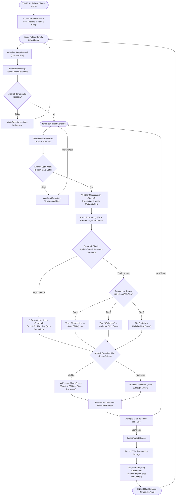

# Flowchart — Main Control Loop (MAPE-K Per-Container Decision)

> **Kode Sumber:** `framework/main.py` → fungsi `main()` (baris 190–480), khususnya loop per-container (baris 270–460)
> **Posisi di Diagram:** Ini adalah **alur keseluruhan** yang menyatukan Layer 1–4 + Supplementary
> **Kategori:** 🌟 INOVASI ALGORITMA (S2) — Closed-Loop MAPE-K Orchestration

Flowchart ini menunjukkan bagaimana semua algoritma terintegrasi dalam satu **siklus kontrol tertutup** per polling cycle. Inilah "otak utama" HECF.

```mermaid
flowchart TD
    START(["main() — HECF Control Loop Start"])

    INIT["<b>Cold-Start Initialization</b><br/>• profile_host() → cpu_count, mem, P_idle, P_max, hw_sensor<br/>• _init_security() → security modules<br/>• Initialize: Monitor, Guardrail, TierDetector, EMAPredictor<br/>• current_interval = 30s"]

    LOOP_START(["WHILE TRUE — Polling Cycle"])

    CHECK_ACTIVE["Baca framework_status.json<br/>is_active = True/False"]
    SLEEP["time.sleep(current_interval)<br/>(10s atau 30s, adaptif)"]
    READ_HW["Baca hardware power sensor<br/>(jika tersedia)"]

    DISCOVER["<b>Layer 1:</b> discover_containers()<br/>Discover + Tag + Whitelist Filter"]
    SECURITY_GATE["Security Gate:<br/>Image signing + Privilege guard"]
    NO_TARGETS{"Tidak ada<br/>container?"}
    WAIT["Warning: No targets<br/>Kembali ke loop"]

    OVERHEAD["overhead_tracker.get_overhead()<br/>Ukur CPU/RAM HECF sendiri"]

    CONTAINER_LOOP(["FOR EACH container in targets"])

    subgraph PER_CONTAINER["Per-Container Processing"]
        ZOMBIE_HEAL["[Security] ZombieHealer.evaluate()<br/>Jika action=heal → restart container<br/><i>Skip normal shaping</i>"]

        L2_MONITOR["<b>Layer 2:</b> monitor.get_stats(name, id)<br/>Baca cpu.stat, memory.stat dari cgroupfs"]
        STALE{"Stats<br/>stale?"}
        SKIP_STALE["Skip shaping<br/>(container mungkin mati)"]

        L3B["<b>Layer 3B:</b> tier_detector.add_sample(name, cpu)<br/>tier_int = tier_detector.get_tier(name)<br/><i>P95/P50 + Hysteresis</i>"]
        L3C["<b>Layer 3C:</b> ema_pred = predictor.update(name, cpu)<br/><i>Y(t) = α × cpu + (1-α) × Y(t-1)</i>"]
        L3A["<b>Layer 3A:</b> guardrail.update(name, cpu, mem, ema_pred)<br/><i>3-of-5 rolling + PSI (Pressure Stall Information) + EMA threshold adjust</i>"]

        EDOS_CHECK{"[Security] EDoS<br/>action=freeze?"}
        EDOS_FREEZE["action = EDOS_FREEZE<br/>micro_freezer._freeze(name, id)"]

        MODE_CHECK{"MODE?"}

        DEFAULT_DOCKER["default_docker:<br/>action = OBSERVE<br/>quota = unlimited"]
        STATIC_CAP["static_cap:<br/>action = STATIC<br/>quota = 80% fixed"]
        REACTIVE_ONLY["reactive_only:<br/>Guardrail aktif → GUARDRAIL<br/>Tidak aktif → SOFT"]

        subgraph FULL_HECF["full_hecf (Sistem yang Diajukan)"]
            GR_ACTIVE{"Guardrail<br/>aktif?"}
            GR_ACTION["action = GUARDRAIL<br/>quota = 50000 (0.5 core)<br/>mem_ratio = 0.70"]
            TIER_BRANCH{"tier_int?"}
            T1["Tier 1 → AGGRESSIVE<br/>quota = 75000 (0.75 core)<br/>mem_ratio = 0.80"]
            T2["Tier 2 → BALANCED<br/>quota = 90000 (0.9 core)"]
            T3["Tier 3 → SOFT<br/>quota = unlimited"]
        end

        MICRO_FREEZE_CHECK["<b>Layer 4 ext:</b> Micro-Freeze evaluate()<br/>Cek idle + populated + safety + eBPF"]
        MF_RESULT{"Freeze<br/>eligible?"}
        MF_ACTION["action = MICRO_FREEZE<br/>evaluate() returns 'freeze'<br/>quota = skip (CPU already 0%)"]
        MF_THAW["evaluate() returns 'thaw'<br/>Resume normal shaping"]

        L4_SHAPE["<b>Layer 4:</b> shape_container()<br/>Tulis cpu.max, memory.max ke cgroups"]

        ENERGY_EST["<b>Supplementary:</b> estimate_all()<br/>Hitung power (W) dan energy (kWh)"]

        CSV_ROW["Kumpulkan CSV row:<br/>time, name, cpu, mem, tier,<br/>action, power, energy, ema,<br/>alpha, spike_ratio, p50, p95,<br/>overhead_cpu, overhead_mem"]
    end

    CSV_WRITE["Atomic CSV write:<br/>Append semua row ke metrics.csv"]
    CLEANUP["Cleanup state container<br/>yang sudah hilang"]
    ADAPTIVE["current_interval =<br/>get_adaptive_interval(max_cpu_seen)"]

    START --> INIT
    INIT --> LOOP_START
    LOOP_START --> CHECK_ACTIVE
    CHECK_ACTIVE --> SLEEP
    SLEEP --> READ_HW
    READ_HW --> DISCOVER
    DISCOVER --> SECURITY_GATE
    SECURITY_GATE --> NO_TARGETS
    NO_TARGETS -->|Ya| WAIT
    WAIT --> LOOP_START
    NO_TARGETS -->|Tidak| OVERHEAD
    OVERHEAD --> CONTAINER_LOOP

    CONTAINER_LOOP --> ZOMBIE_HEAL
    ZOMBIE_HEAL -->|"Healed: skip"| CONTAINER_LOOP
    ZOMBIE_HEAL -->|"Normal"| L2_MONITOR
    L2_MONITOR --> STALE
    STALE -->|Ya| SKIP_STALE

    STALE -->|Tidak| L3B
    L3B --> L3C
    L3C --> L3A

    L3A --> EDOS_CHECK
    EDOS_CHECK -->|"Ya: EDoS attack"| EDOS_FREEZE
    EDOS_CHECK -->|"Tidak: Normal"| MODE_CHECK
    EDOS_FREEZE --> ENERGY_EST
    MODE_CHECK -->|default_docker| DEFAULT_DOCKER
    MODE_CHECK -->|static_cap| STATIC_CAP
    MODE_CHECK -->|reactive_only| REACTIVE_ONLY
    MODE_CHECK -->|full_hecf| GR_ACTIVE

    GR_ACTIVE -->|Ya| GR_ACTION
    GR_ACTIVE -->|Tidak| TIER_BRANCH
    TIER_BRANCH -->|1| T1
    TIER_BRANCH -->|2| T2
    TIER_BRANCH -->|3| T3

    GR_ACTION --> MICRO_FREEZE_CHECK
    T1 --> MICRO_FREEZE_CHECK
    T2 --> MICRO_FREEZE_CHECK
    T3 --> MICRO_FREEZE_CHECK
    DEFAULT_DOCKER --> ENERGY_EST
    STATIC_CAP --> MICRO_FREEZE_CHECK
    REACTIVE_ONLY --> MICRO_FREEZE_CHECK

    MICRO_FREEZE_CHECK --> MF_RESULT
    MF_RESULT -->|Ya, freeze| MF_ACTION
    MF_RESULT -->|Thaw| MF_THAW
    MF_RESULT -->|Tidak| L4_SHAPE

    MF_ACTION --> ENERGY_EST
    MF_THAW --> L4_SHAPE
    L4_SHAPE --> ENERGY_EST
    ENERGY_EST --> CSV_ROW

    CSV_ROW -->|Container berikutnya| CONTAINER_LOOP
    CSV_ROW -->|Semua selesai| CSV_WRITE
    SKIP_STALE -->|Container berikutnya| CONTAINER_LOOP

    CSV_WRITE --> CLEANUP
    CLEANUP --> ADAPTIVE
    ADAPTIVE --> LOOP_START
```

---

## Alur Logika Konseptual

---

## 🔗 Penjelasan Orkestrasi (Hubungan Antar File Kode)

Diagram di atas merupakan visualisasi dari logika *loop* utama yang berjalan di dalam file `framework/main.py`. Berikut adalah penjelasan naratif bagaimana file-file algoritma (yang daftarnya ada di `big_picture.md`) dipanggil dan saling berinteraksi secara berurutan dalam satu putaran waktu (polling cycle):

1. **Inisialisasi (Luar Loop)**: Sebelum putaran dimulai, `main.py` memanggil `profiler.py` dan `hardware_sensor.py` untuk mengukur kapasitas maksimal server.
2. **Penemuan Target (`profiler.py`)**: Di awal setiap putaran, `main.py` meminta `profiler.py` mencari semua kontainer target yang sedang menyala menggunakan Docker.
3. **Membaca Data Nyata (`monitor.py`)**: Untuk setiap kontainer, `main.py` memanggil fungsi dari `monitor.py` untuk terjun langsung ke kernel Linux dan mencatat berapa % CPU yang sedang dipakai detik ini.
4. **Analisis Berantai (Layer 3)**:
   - Data % CPU dari `monitor.py` langsung dilempar oleh `main.py` ke **`tier_detector.py`** untuk diberi label (Spiky/Tenang).
   - Angka yang sama dilempar juga ke **`predictor.py`** untuk ditebak tren ke depannya.
   - Tebakan tersebut beserta angka pemakaian RAM dilempar ke **`guardrail.py`** untuk memastikan apakah server akan _hang_ atau tidak.
5. **Tindakan/Eksekusi (`shaper.py` & `security/micro_freezer.py`)**:
   - Jika `monitor.py` melaporkan kontainer sedang menganggur total (0%), `main.py` menyuruh `micro_freezer.py` untuk membekukan sementara kontainer tersebut.
   - Jika tidak menganggur, `main.py` akan melihat kesimpulan dari Guardrail dan Tier Detector, menghitung batasan angka (kuota), lalu menyuruh `shaper.py` menulis kuota tersebut ke sistem operasi.

Semua langkah ini diulang terus-menerus untuk setiap kontainer, menghasilkan aliran data yang lancar antar file algoritma.

---

## 📖 Glosarium (Keterangan Istilah Teknis)

Untuk mempermudah pemahaman arsitektur, berikut adalah penjelasan singkat mengenai istilah-istilah teknis yang digunakan:

*   **Hysteresis**: Mekanisme penundaan perubahan status untuk mencegah osilasi (perubahan aksi yang terlalu cepat dan berulang) saat terjadi fluktuasi beban yang bersifat sementara.
*   **eBPF (Extended Berkeley Packet Filter)**: Teknologi sistem Linux yang memungkinkan eksekusi program pemantauan secara cepat dan aman di dalam kernel tanpa memodifikasi kode inti OS.
*   **EDoS (Economic Denial of Sustainability)**: Varian serangan siber yang tidak bertujuan mematikan server, melainkan mengeksploitasi komputasi secara konstan agar tagihan infrastruktur cloud perusahaan meningkat drastis.
*   **Adaptive Sampling**: Teknik pemantauan dinamis di mana sistem secara otomatis mempercepat interval pengumpulan data saat mendeteksi adanya lonjakan beban kritis operasional.
