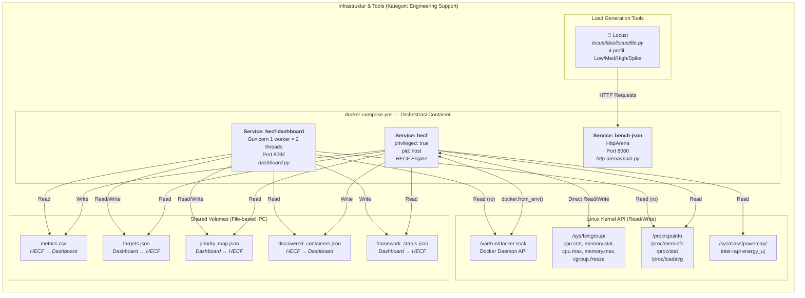
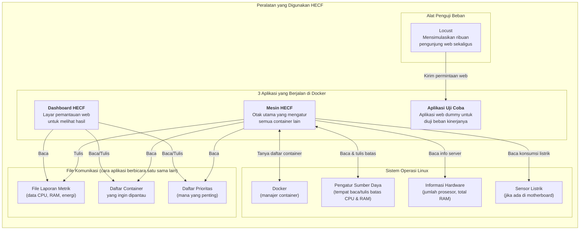

# Diagram Tools — Infrastruktur Teknologi HECF

> **Kategori:** Tools / Engineering Support (S1)
> **Sumber:** `docker-compose.yml`, `Dockerfile`, `requirements.txt`

Diagram ini menunjukkan **tumpukan teknologi (technology stack)** yang digunakan HECF — Docker, Linux Kernel, Locust, HttpArena — dan bagaimana mereka terhubung secara infrastruktur. Ini BUKAN algoritma, melainkan *tools* yang menjadi wadah eksekusi algoritma.

## Pemetaan File → Infrastruktur

| File | Peran | Kategori |
|---|---|---|
| `docker-compose.yml` | Konfigurasi deployment 3 service | Infrastruktur |
| `Dockerfile` | Build image Python + dependencies | Infrastruktur |
| `requirements.txt` | numpy, docker, flask, gunicorn, locust | Infrastruktur |
| `dashboard.py` | Web UI visualisasi 5 metrik | Tools (S1) |
| `http-arena/main.py` | Benchmark workload (JSON/Static/DB) | Tools (S1) |
| `locustfiles/locustfile.py` | Generator beban lalu lintas | Tools (S1) |
| `targets.json`, `priority_map.json` | Shared state antar proses | Infrastruktur |
| `metrics.csv` | Data bridge engine → dashboard | Infrastruktur |

---

## Versi Bahasa Sehari-hari

