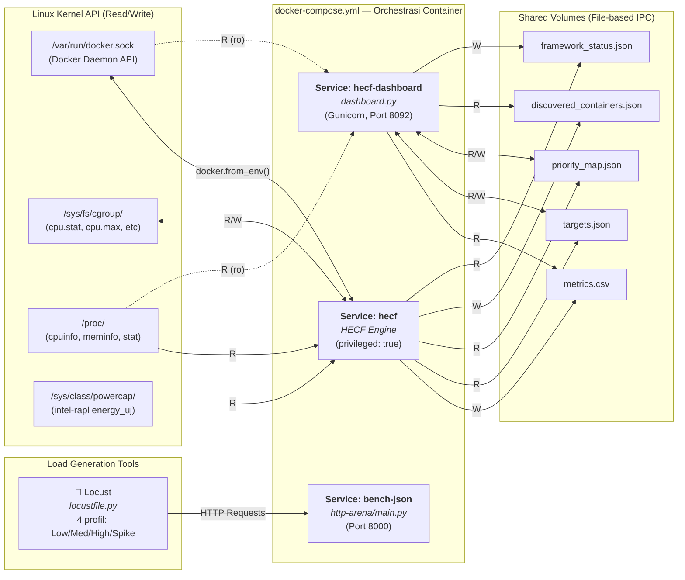
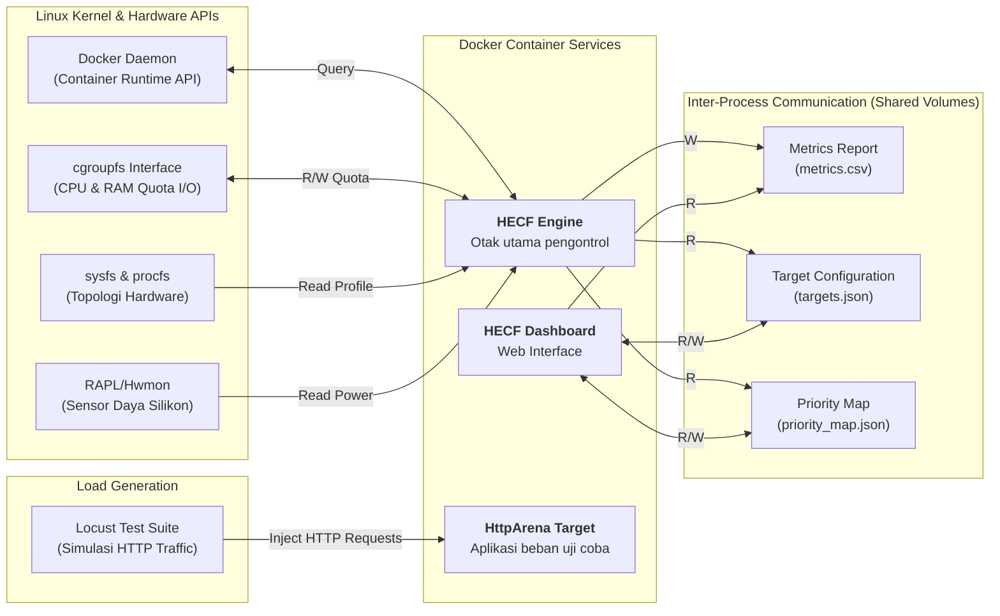

# Diagram Tools — Infrastruktur Teknologi HECF

> **Kategori:** Tools / Engineering Support (S1)
> **Sumber:** `docker-compose.yml`, `Dockerfile`, `requirements.txt`

Diagram ini menunjukkan **tumpukan teknologi (technology stack)** yang digunakan HECF — Docker, Linux Kernel, Locust, HttpArena — dan bagaimana mereka terhubung secara infrastruktur. Ini BUKAN algoritma, melainkan *tools* yang menjadi wadah eksekusi algoritma.

```mermaid
flowchart LR
    subgraph KERNEL_API["Linux Kernel API (Read/Write)"]
        direction TB
        SOCK["/var/run/docker.sock<br/>(Docker Daemon API)"]
        CGROUP["/sys/fs/cgroup/<br/>(cpu.stat, cpu.max, etc)"]
        PROC["/proc/<br/>(cpuinfo, meminfo, stat)"]
        RAPL["/sys/class/powercap/<br/>(intel-rapl energy_uj)"]
    end

    subgraph DOCKER_COMPOSE["docker-compose.yml — Orchestrasi Container"]
        direction TB
        HECF_SVC["<b>Service: hecf</b><br/><i>HECF Engine</i><br/>(privileged: true)"]
        DASH_SVC["<b>Service: hecf-dashboard</b><br/><i>dashboard.py</i><br/>(Gunicorn, Port 8092)"]
        BENCH_SVC["<b>Service: bench-json</b><br/><i>http-arena/main.py</i><br/>(Port 8000)"]
    end

    subgraph VOLUMES["Shared Volumes (File-based IPC)"]
        direction TB
        CSV["metrics.csv"]
        TARGETS["targets.json"]
        PRIO["priority_map.json"]
        DISC["discovered_containers.json"]
        STATUS["framework_status.json"]
    end

    subgraph LOAD_GEN["Load Generation Tools"]
        LOCUST["🔧 Locust<br/><i>locustfile.py</i><br/>4 profil: Low/Med/High/Spike"]
    end

    %% Hubungan Kernel -> Docker Services
    SOCK <-->|"docker.from_env()"| HECF_SVC
    CGROUP <-->|"R/W"| HECF_SVC
    PROC -->|"R"| HECF_SVC
    RAPL -->|"R"| HECF_SVC

    SOCK -.->|"R (ro)"| DASH_SVC
    PROC -.->|"R (ro)"| DASH_SVC

    %% Hubungan Docker Services -> Shared Volumes
    HECF_SVC -->|"W"| CSV
    HECF_SVC -->|"R"| TARGETS
    HECF_SVC -->|"R"| PRIO
    HECF_SVC -->|"W"| DISC
    HECF_SVC -->|"R"| STATUS

    DASH_SVC -->|"R"| CSV
    DASH_SVC <-->|"R/W"| TARGETS
    DASH_SVC <-->|"R/W"| PRIO
    DASH_SVC -->|"R"| DISC
    DASH_SVC -->|"W"| STATUS

    %% Hubungan Load Generator -> Target
    LOCUST -->|"HTTP Requests"| BENCH_SVC
```

## Pemetaan File → Infrastruktur

| File | Peran | Kategori |
| --- | --- | --- |
| `docker-compose.yml` | Konfigurasi deployment 3 service | Infrastruktur |
| `Dockerfile` | Build image Python + dependencies | Infrastruktur |
| `requirements.txt` | numpy, docker, flask, gunicorn, locust | Infrastruktur |
| `dashboard.py` | Web UI visualisasi 5 metrik | Tools (S1) |
| `http-arena/main.py` | Benchmark workload (JSON/Static/DB) | Tools (S1) |
| `locustfiles/locustfile.py` | Generator beban lalu lintas | Tools (S1) |
| `targets.json`, `priority_map.json` | Shared state antar proses | Infrastruktur |
| `metrics.csv` | Data bridge engine → dashboard | Infrastruktur |

---

## Alur Logika Konseptual

```mermaid
flowchart LR
    subgraph OS["Linux Kernel & Hardware APIs"]
        direction TB
        DOCKER_API["Docker Daemon<br/>(Container Runtime API)"]
        PENGATUR["cgroupfs Interface<br/>(CPU & RAM Quota I/O)"]
        INFO["sysfs & procfs<br/>(Topologi Hardware)"]
        LISTRIK["RAPL/Hwmon<br/>(Sensor Daya Silikon)"]
    end

    subgraph APPS["Docker Container Services"]
        direction TB
        MESIN["<b>HECF Engine</b><br/>Otak utama pengontrol"]
        LAYAR["<b>HECF Dashboard</b><br/>Web Interface"]
        BENCHMARK["<b>HttpArena Target</b><br/>Aplikasi beban uji coba"]
    end

    subgraph FILE["Inter-Process Communication (Shared Volumes)"]
        direction TB
        LAPORAN["Metrics Report<br/>(metrics.csv)"]
        DAFTAR["Target Configuration<br/>(targets.json)"]
        PRIORITAS["Priority Map<br/>(priority_map.json)"]
    end

    subgraph PENGUJI["Load Generation"]
        LOCUST["Locust Test Suite<br/>(Simulasi HTTP Traffic)"]
    end

    DOCKER_API <-->|"Query"| MESIN
    PENGATUR <-->|"R/W Quota"| MESIN
    INFO -->|"Read Profile"| MESIN
    LISTRIK -->|"Read Power"| MESIN

    MESIN -->|"W"| LAPORAN
    MESIN -->|"R"| DAFTAR
    MESIN -->|"R"| PRIORITAS

    LAYAR -->|"R"| LAPORAN
    LAYAR <-->|"R/W"| DAFTAR
    LAYAR <-->|"R/W"| PRIORITAS

    LOCUST -->|"Inject HTTP Requests"| BENCHMARK
```

---

## 🔌 Hubungan Infrastruktur dengan Algoritma (HECF Engine)

Jika `big_picture.md` dan `main_control_loop.md` membahas otak dari algoritma (isi dari folder `framework/`), maka diagram infrastruktur di atas menunjukkan **rumah dan lingkungan** di mana algoritma tersebut hidup.

1. **HECF Engine (`framework/main.py`)**: Ini adalah blok utama yang menjalankan seluruh *codingan* algoritma yang dijelaskan di file sebelumnya. Diinjeksi dalam bentuk _container_ mandiri lewat `docker-compose.yml`.
2. **Dashboard (`dashboard.py`)**: Algoritma HECF Engine tidak memiliki tampilan grafis. Oleh karena itu, *engine* akan membuang hasil hitungannya ke file `metrics.csv`. Dashboard bertugas membaca file tersebut dan menampilkannya menjadi grafik yang indah di browser. 
3. **Pemberi Beban (`locustfile.py`)**: Untuk membuktikan apakah algoritma di Layer 3 dan Layer 4 berfungsi dengan baik menahan beban, sistem membutuhkan simulasi serangan _traffic_ internet. Locust yang mengambil peran ini.
4. **Target (`http-arena/main.py`)**: Ini adalah kontainer aplikasi bohongan (dummy) yang pura-pura menjadi server web. Algoritma HECF Engine (*Layer 2*) akan memonitor kontainer ini, sementara Locust menembaknya dengan _traffic_.
