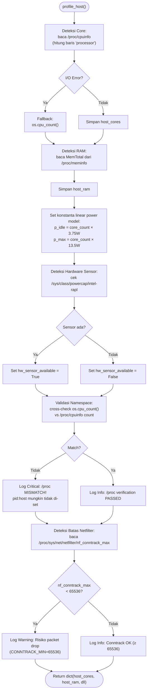

# Flowchart — Profiler.profile_host() (Layer 1)

> **Kode Sumber:** `framework/profiler.py` → class `EnvironmentProfiler`, fungsi `profile_host()` (baris 35–88)
> **Posisi di Diagram:** Layer 1 — Environment Profiler → Host Detection
> **Kategori:** 🛠️ TOOLS & INFRASTRUKTUR (S1)

Sistem profilasi otomatis. Menghindari hardcoding parameter. Mendeteksi topologi CPU dan memori secara dinamis agar model estimasi energi bisa melakukan self-calibration sesuai server tempat HECF dijalankan (mendukung portabilitas).



## Alur Logika Konseptual

```mermaid
flowchart TD
    START(["Host Profiling (Cold-Start)"])

    CEK_CPU["Deteksi Topologi CPU (Logical Processors)"]
    CPU_GAGAL{"Eksekusi<br/>Gagal?"}
    CPU_CADANGAN["Fallback: API OS (os.cpu_count)"]
    CPU_DAPAT["Host Cores terverifikasi"]

    CEK_RAM["Deteksi Kapasitas RAM"]
    RAM_DAPAT["Host RAM terverifikasi"]

    HITUNG_DAYA["Kalkulasi Konstanta Estimasi Daya:<br/>• Baseline (P_idle) = cores × 3.75W<br/>• Max (P_max) = cores × 13.5W"]

    CEK_SENSOR["Deteksi Hardware Sensor (RAPL/hwmon)"]
    SENSOR_ADA{"Sensor<br/>Tersedia?"}
    SENSOR_YA["✅ Mode Hardware-True"]
    SENSOR_TIDAK["⚠ Fallback: Software Estimation"]

    CEK_ASLI["Verifikasi Namespace:<br/>cross-check os.cpu_count() vs /proc/cpuinfo"]
    ASLI{"Jumlah Core<br/>Match?"}
    ASLI_OK["✅ /proc Verification PASSED"]
    ASLI_GAGAL["⚠ Log Critical: /proc MISMATCH<br/>(pid:host belum di-set)"]]

    CEK_JARINGAN["Verifikasi nf_conntrack_max<br/>(threshold: 65536)"]
    JARINGAN{"nf_conntrack_max<br/>≥ 65536?"}
    JARINGAN_OK["✅ Conntrack OK"]
    JARINGAN_WARN["⚠ Peringatan: Risiko packet drop"]

    SELESAI(["Profil Host Terbentuk (Ready)"])

    START --> CEK_CPU
    CEK_CPU --> CPU_GAGAL
    CPU_GAGAL -->|Ya| CPU_CADANGAN
    CPU_GAGAL -->|Tidak| CPU_DAPAT
    CPU_CADANGAN --> CEK_RAM
    CPU_DAPAT --> CEK_RAM
    CEK_RAM --> RAM_DAPAT
    RAM_DAPAT --> HITUNG_DAYA
    HITUNG_DAYA --> CEK_SENSOR
    CEK_SENSOR --> SENSOR_ADA
    SENSOR_ADA -->|Ya| SENSOR_YA
    SENSOR_ADA -->|Tidak| SENSOR_TIDAK
    SENSOR_YA --> CEK_ASLI
    SENSOR_TIDAK --> CEK_ASLI
    CEK_ASLI --> ASLI
    ASLI -->|Ya| ASLI_OK
    ASLI -->|Tidak| ASLI_GAGAL
    ASLI_OK --> CEK_JARINGAN
    ASLI_GAGAL --> CEK_JARINGAN
    CEK_JARINGAN --> JARINGAN
    JARINGAN -->|Ya| JARINGAN_OK
    JARINGAN -->|Tidak| JARINGAN_WARN
    JARINGAN_OK --> SELESAI
    JARINGAN_WARN --> SELESAI
```
