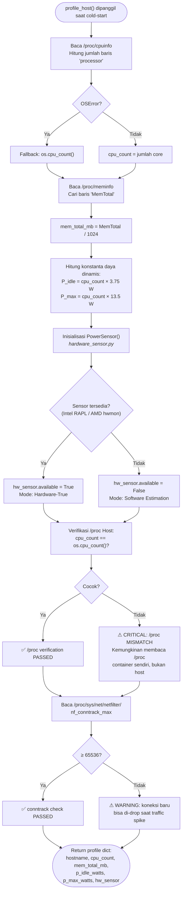

# Flowchart — profile_host()

> **Kode Sumber:** `framework/profiler.py` → fungsi `profile_host()` (baris 20–91)
> **Posisi di Diagram:** Layer 1 — Environment Profiler
> **Kategori:** Tools / Data Acquisition (S1)

Fungsi ini berjalan **sekali saat cold-start**. Membaca kapasitas hardware host dan menginisialisasi sensor daya.

