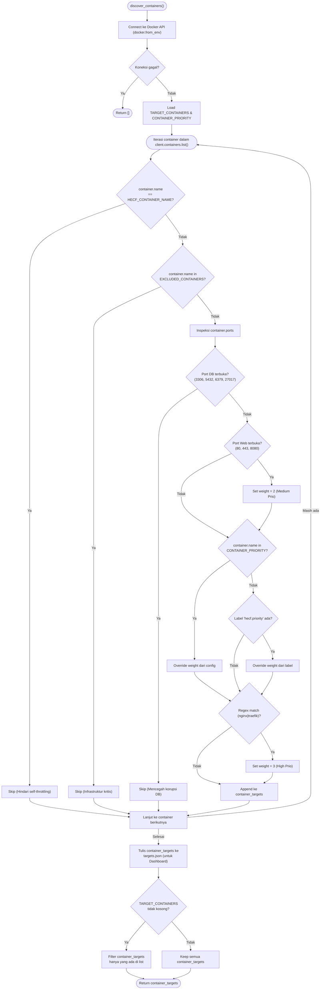
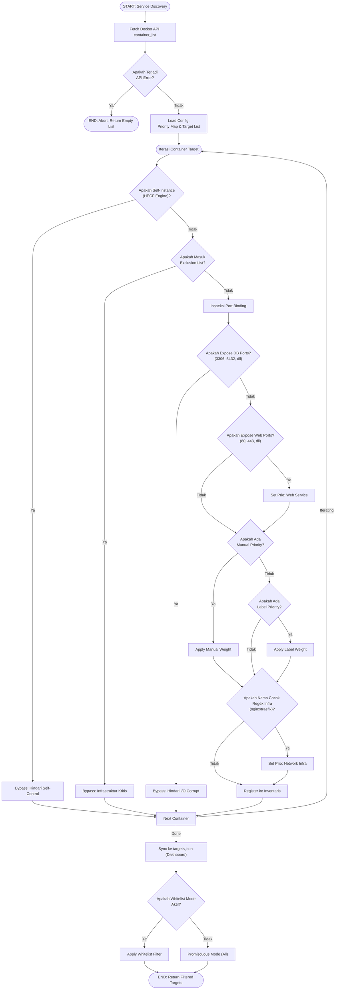

# Flowchart — Profiler.discover_containers() (Layer 1)

> **Kode Sumber:** `framework/profiler.py` → class `EnvironmentProfiler`, fungsi `discover_containers()` (baris 91–170)
> **Posisi di Diagram:** Layer 1 — Environment Profiler → Container Discovery
> **Kategori:** 🛠️ TOOLS & INFRASTRUKTUR (S1)

Sistem pencarian target otomatis melalui socket Docker. Dilengkapi dengan deteksi keamanan (Safety Gate) yang mencegah modifikasi pada container infrastruktur dan database secara hardcoded untuk meminimalisasi risiko sistem crash.

## Alur Logika Konseptual

