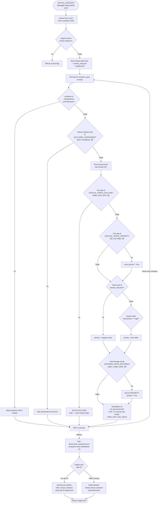
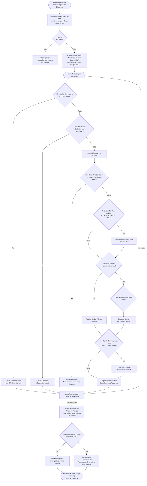

# Flowchart — discover_containers()

> **Kode Sumber:** `framework/profiler.py` → fungsi `discover_containers()` (baris 94–260)
> **Posisi di Diagram:** Layer 1 — Environment Profiler → Container Discovery & Tagging
> **Kategori:** Tools / Data Acquisition (S1)

Fungsi ini berjalan **setiap polling cycle**. Menemukan semua container running, melakukan filtering dan tagging prioritas, kemudian menerapkan whitelist.

---

## Deskripsi Alur Berbasis Bisnis/Akademik

