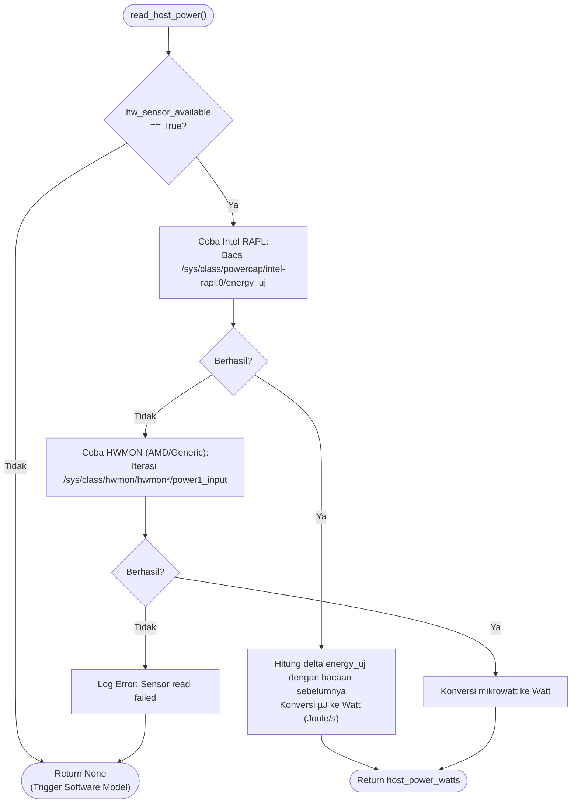
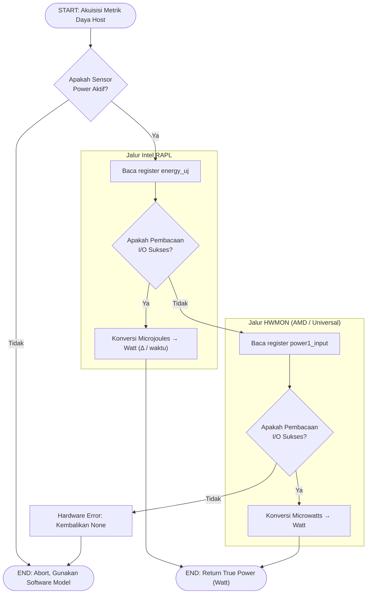

# Flowchart — Profiler.read_host_power() (Layer 1)

> **Kode Sumber:** `framework/profiler.py` → class `EnvironmentProfiler`, fungsi `read_host_power()` (baris 172–215)
> **Posisi di Diagram:** Layer 1 — Environment Profiler → RAPL/hwmon Sensor Reader
> **Kategori:** 🛠️ TOOLS & INFRASTRUKTUR (S1)

Sistem pembaca sensor energi tingkat silikon. Jika didukung oleh motherboard, metode ini memberikan data konsumsi daya absolut (True Power) dengan margin error <2%, jauh lebih akurat dibandingkan dengan Software Power Estimation.

## Alur Logika Konseptual

