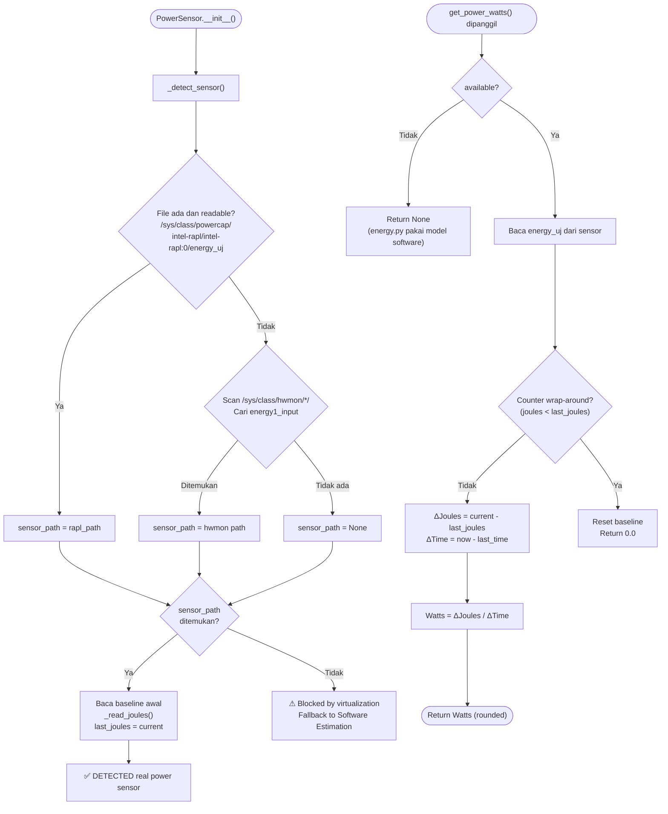
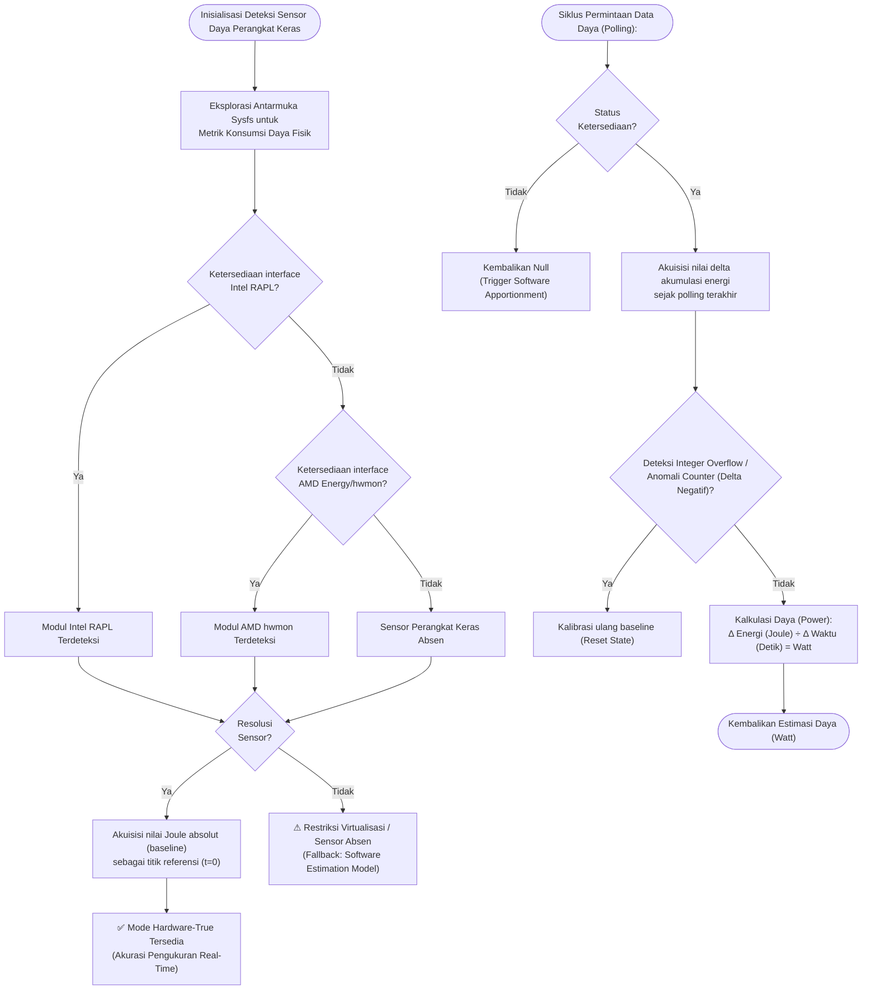

# Flowchart — PowerSensor (Hardware Energy Detection)

> **Kode Sumber:** `framework/hardware_sensor.py` → class `PowerSensor` (baris 12–87)
> **Posisi di Diagram:** Layer 1 — Hybrid HW Sensor Detection
> **Kategori:** Tools / Data Acquisition (S1)

Mendeteksi apakah sensor daya hardware tersedia (Intel RAPL atau AMD hwmon). Jika ya, membaca Joule nyata dari motherboard. Jika tidak, fallback ke model estimasi perangkat lunak.

---

## Deskripsi Alur Berbasis Bisnis/Akademik

