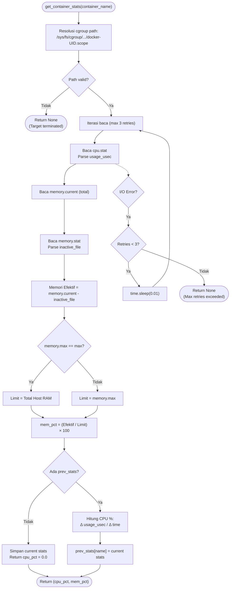
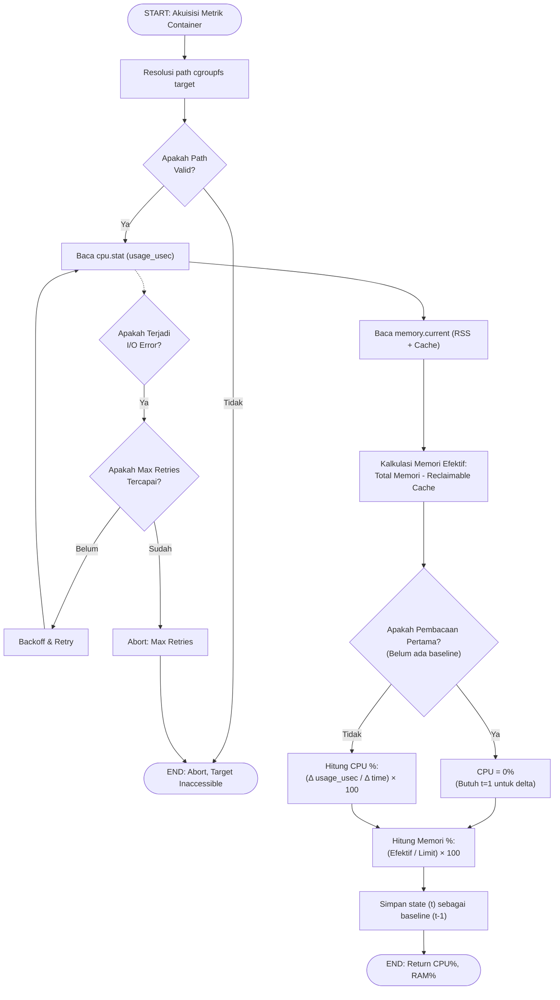
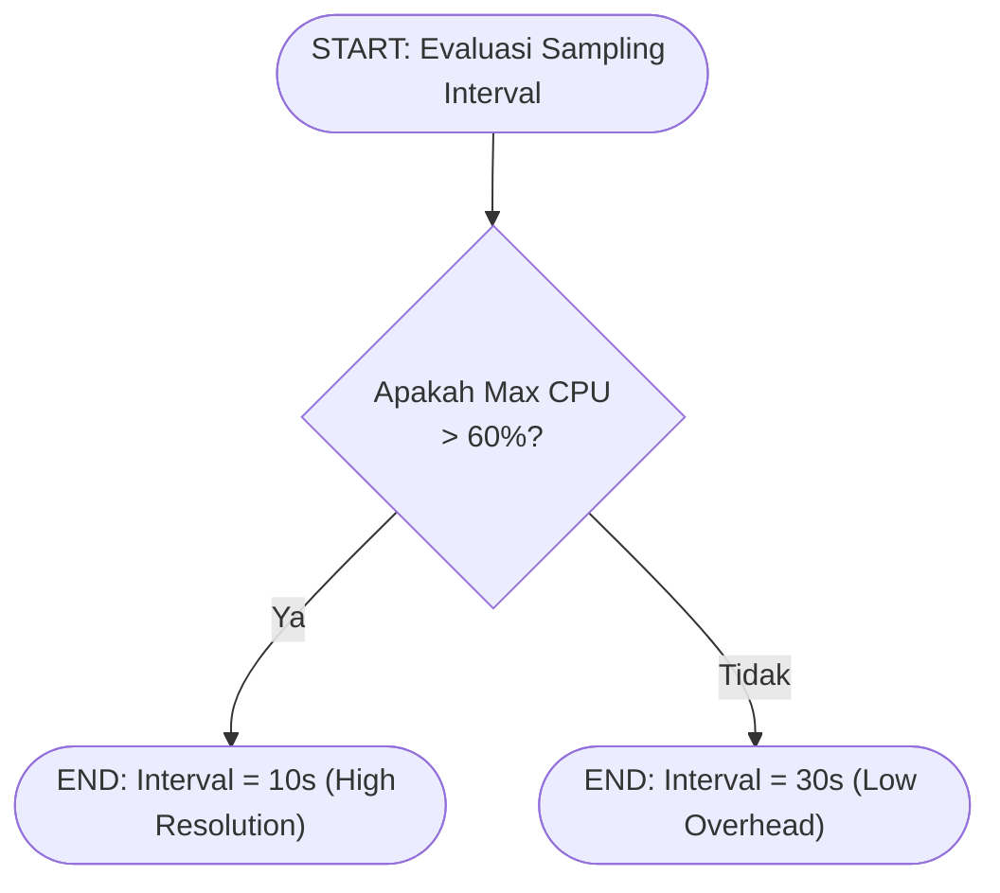

# Flowchart — Monitor.get_container_stats() (Layer 2)

> **Kode Sumber:** `framework/monitor.py` → class `ContainerMonitor`, fungsi `get_container_stats()` (baris 32–105)
> **Posisi di Diagram:** Layer 2 — Monitoring Engine → Direct cgroupfs v2 Read
> **Kategori:** 🌟 INOVASI ALGORITMA (S2)

Algoritma pembacaan I/O kernel langsung tanpa perantara Docker API. Metode ini memangkas latency overhead dari ~15ms (Docker API) menjadi <1ms (Sysfs Read), sangat kritikal untuk sampling rate tinggi (adaptive sampling).

## Alur Logika Konseptual

### Akuisisi Metrik Utilisasi

### Penyesuaian Frekuensi Pemantauan (Adaptive Sampling)

