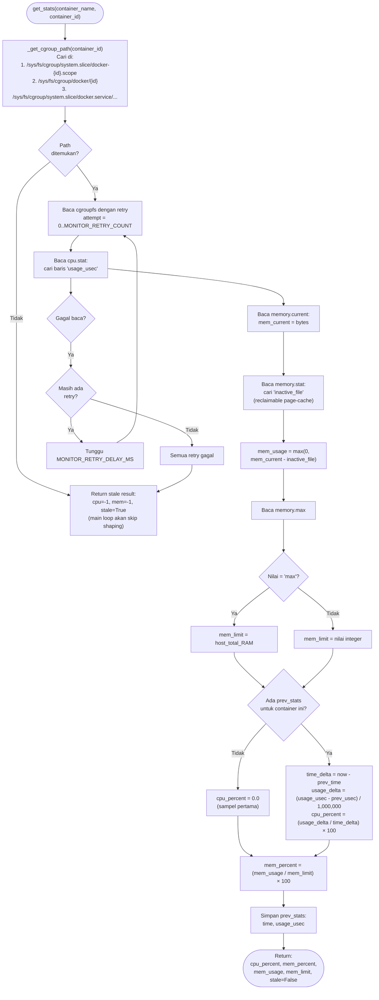
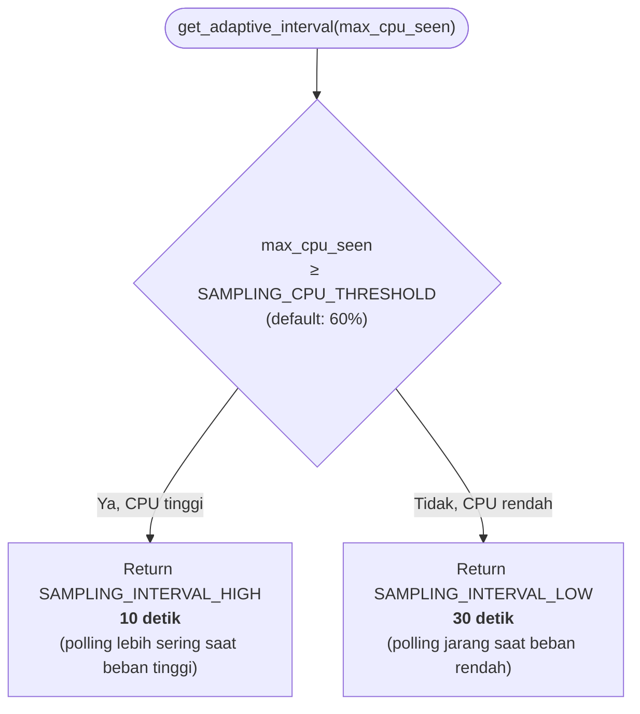

# Flowchart — Monitor.get_stats() & Adaptive Sampling

> **Kode Sumber:** `framework/monitor.py` → class `Monitor`, fungsi `get_stats()` (baris 102–155) dan `get_adaptive_interval()` (baris 179–186)
> **Posisi di Diagram:** Layer 2 — Monitoring Engine
> **Kategori:** Tools / Data Acquisition (S1) + Inovasi Metode (Adaptive Sampling)

Membaca CPU dan Memory langsung dari cgroupfs v2 (bypass Docker REST API). Algoritma **Adaptive Sampling** mengubah interval polling berdasarkan beban.

---

## Flowchart — Adaptive Sampling Interval

> **Kode Sumber:** `framework/monitor.py` → `get_adaptive_interval()` (baris 179–186)
> **Kategori:** Inovasi Metode (S2) — Optimasi overhead monitoring

### Penjelasan Inovasi Adaptive Sampling
Monitoring konvensional menggunakan interval tetap (misal selalu 5 detik). Ini boros overhead saat server idle. Pendekatan HECF menyesuaikan frekuensi sampling secara dinamis berdasarkan kondisi CPU terakhir — sehingga overhead monitoring turun secara otomatis saat beban rendah, dan responsivitas naik saat beban tinggi.
