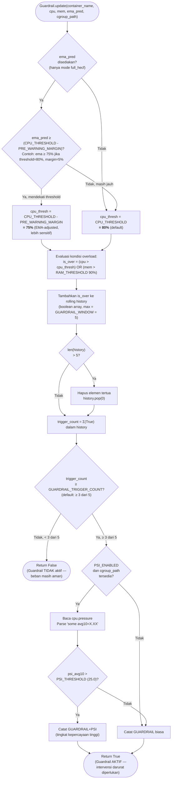

# Flowchart — Guardrail.update() (Layer 3A)

> **Kode Sumber:** `framework/guardrail.py` → class `Guardrail`, fungsi `update()` (baris 30–65) dan `_get_effective_cpu_threshold()` (baris 67–85)
> **Posisi di Diagram:** Layer 3 — Hybrid Control Engine → 3A Guardrail (3-of-5 + PSI)
> **Kategori:** 🌟 INOVASI ALGORITMA (S2)

Algoritma **Reactive Debouncing** menggunakan Rolling Boolean Array. Mengevaluasi apakah kondisi overload terjadi di **minimal 3 dari 5 sampel terakhir** — mencegah reaksi terhadap micro-spike yang tidak berbahaya. Diintegrasikan dengan sinyal PSI kernel dan threshold EMA-adjusted.



### Mengapa Ini Inovasi S2?
1. **Rolling Boolean Array (3-of-5):** Bukan sekadar `if cpu > 80%`. Algoritma ini mengevaluasi pola temporal — hanya memicu intervensi jika anomali **persisten**, bukan sesaat.
2. **EMA-Adjusted Threshold:** Threshold bergeser secara proaktif berdasarkan prediksi EMA dari Layer 3C. Ini adalah integrasi antar-algoritma (prediktif → reaktif).
3. **PSI Confirmation Signal:** Menggunakan sinyal *Pressure Stall Information* dari kernel Linux sebagai variabel konfirmasi tambahan, meningkatkan akurasi keputusan.

---

## Deskripsi Alur Berbasis Bisnis/Akademik

```mermaid
flowchart TD
    START(["Evaluasi Status Kritis (Overload Detection)"])

    PREDIKSI{"Integrasi Prediktor<br/>(EMA) Aktif?"}
    MENDEKATI{"Prediksi utilisasi<br/>mendekati ambang batas<br/>(Threshold)?"}
    BATAS_RENDAH["Reduksi Threshold Proaktif<br/>(Tingkatkan sensitivitas respons Guardrail)"]
    BATAS_NORMAL["Terapkan Threshold Standar"]

    CEK["Evaluasi Matriks Utilisasi:<br/>Apakah CPU ATAU Memori<br/>melampaui ambang batas?"]

    CATAT["Agregasi State (Rolling History):<br/>(Simpan ke buffer boolean 5-sampel)"]

    PENUH{"Buffer<br/>Penuh (>5)?"}
    BUANG["Eviksi state terlama (FIFO)"]

    HITUNG["Kalkulasi Bobot Anomali:<br/>Σ(State Overload) dalam buffer"]

    DARURAT{"Bobot Anomali<br/>≥ 3 dari 5?"}

    AMAN(["✅ Status Aman (Nominal)<br/>(Anomali sesaat/Transient Spike)"])

    CEK_PSI{"Kompatibilitas<br/>Pressure Stall Info (PSI)?"}
    BACA_PSI["Akuisisi Sinyal Tekanan (Stall)<br/>dari Kernel Linux"]
    PSI_TINGGI{"Stall Rate<br/>Tinggi?"}
    SANGAT_DARURAT["🚨 KONDISI KRITIS (High Confidence)<br/>(Validasi silang PSI positif)"]
    DARURAT_BIASA["🚨 KONDISI DARURAT<br/>(Beban berlebih persisten)"]

    AKTIF(["Tindakan Preventif (Guardrail) AKTIF<br/>(Restriksi CPU diinisiasi untuk mencegah Starvation)"])

    START --> PREDIKSI
    PREDIKSI -->|Tidak| BATAS_NORMAL
    PREDIKSI -->|Ya| MENDEKATI
    MENDEKATI -->|Ya| BATAS_RENDAH
    MENDEKATI -->|Tidak| BATAS_NORMAL

    BATAS_RENDAH --> CEK
    BATAS_NORMAL --> CEK
    CEK --> CATAT
    CATAT --> PENUH
    PENUH -->|Ya| BUANG
    PENUH -->|Tidak| HITUNG
    BUANG --> HITUNG

    HITUNG --> DARURAT
    DARURAT -->|Tidak (< 3)| AMAN
    DARURAT -->|Ya (≥ 3)| CEK_PSI

    CEK_PSI -->|Tidak| DARURAT_BIASA
    CEK_PSI -->|Ya| BACA_PSI
    BACA_PSI --> PSI_TINGGI
    PSI_TINGGI -->|Ya| SANGAT_DARURAT
    PSI_TINGGI -->|Tidak| DARURAT_BIASA

    SANGAT_DARURAT --> AKTIF
    DARURAT_BIASA --> AKTIF
```
