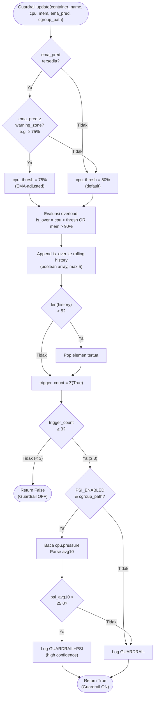
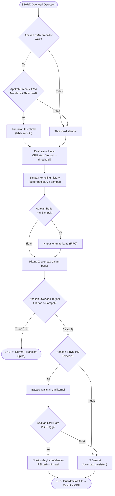

# Flowchart — Guardrail.update() (Layer 3A)

> **Kode Sumber:** `framework/guardrail.py` → class `Guardrail`, fungsi `update()` (baris 30–65) dan `_get_effective_cpu_threshold()` (baris 67–85)
> **Posisi di Diagram:** Layer 3 — Hybrid Control Engine → 3A Guardrail (3-of-5 + PSI)
> **Kategori:** 🌟 INOVASI ALGORITMA (S2)

Algoritma **Reactive Debouncing** menggunakan Rolling Boolean Array. Mengevaluasi apakah kondisi overload terjadi di **minimal 3 dari 5 sampel terakhir** — mencegah reaksi terhadap micro-spike yang tidak berbahaya. Diintegrasikan dengan sinyal PSI kernel dan threshold EMA-adjusted.

## Mengapa Ini Inovasi S2?

1. **Rolling Boolean Array (3-of-5):** Bukan sekadar `if cpu > 80%`. Algoritma ini mengevaluasi pola temporal — hanya memicu intervensi jika anomali **persisten**, bukan sesaat.
2. **EMA-Adjusted Threshold:** Threshold bergeser secara proaktif berdasarkan prediksi EMA dari Layer 3C. Ini adalah integrasi antar-algoritma (prediktif → reaktif).
3. **PSI Confirmation Signal:** Menggunakan sinyal *Pressure Stall Information* dari kernel Linux sebagai variabel konfirmasi tambahan, meningkatkan akurasi keputusan.

---

## Alur Logika Konseptual

