# Flowchart — TierDetector.get_tier() (Layer 3B)

> **Kode Sumber:** `framework/tier_detector.py` → class `TierDetector`, fungsi `add_sample()` (baris 26–31) dan `get_tier()` (baris 33–90)
> **Posisi di Diagram:** Layer 3 — Hybrid Control Engine → 3B Tier Detector (P95/P50)
> **Kategori:** 🌟 INOVASI ALGORITMA (S2)

Algoritma **Statistical Volatility Classification** menggunakan rasio persentil P95/P50 dalam sliding window 120 sampel. Ditambah mekanisme **Hysteresis** untuk mencegah osilasi antar tier.

```mermaid
flowchart TD
    START(["TierDetector — dipanggil setiap polling cycle per container"])

    ADD["add_sample(container_name, cpu)<br/>Tambahkan nilai CPU ke sliding window"]
    TRIM{"len(window)<br/>> TIER_WINDOW (120)?"}
    POP["window.pop(0)<br/>Hapus sampel tertua"]

    GET_TIER(["get_tier(container_name)"])

    COLD{"len(window)<br/>< COLD_START_SAMPLES (30)?"}
    COLD_FALLBACK["Return Tier 2 (Balanced)<br/>Data belum cukup untuk klasifikasi"]

    CALC_P50["p50 = numpy.percentile(window, 50)<br/><i>Median — beban tipikal</i>"]
    CALC_P95["p95 = numpy.percentile(window, 95)<br/><i>Ekor atas — beban puncak/spike</i>"]

    P50_ZERO{"p50 ≤ 0?<br/>(container idle)"}
    IDLE_SOFT["Return Tier 3 (Soft)<br/>Container nyaris idle"]

    CALC_RATIO["spike_ratio = p95 / p50"]

    CLASSIFY{"Klasifikasi<br/>berdasarkan spike_ratio"}
    TIER1["raw_tier = 1 (Aggressive)<br/>spike_ratio > 2.0<br/><i>Beban sangat fluktuatif</i>"]
    TIER2["raw_tier = 2 (Balanced)<br/>1.5 ≤ spike_ratio ≤ 2.0<br/><i>Beban moderat</i>"]
    TIER3["raw_tier = 3 (Soft)<br/>spike_ratio < 1.5<br/><i>Beban stabil/rendah</i>"]

    HYST_INIT{"Pertama kali<br/>untuk container ini?"}
    INIT_STATE["Inisialisasi hysteresis state:<br/>current = raw_tier<br/>pending = raw_tier<br/>count = HYSTERESIS_SAMPLES"]
    RETURN_RAW(["Return raw_tier"])

    SAME_CURRENT{"raw_tier ==<br/>state.current?"}
    RESET_PENDING["Reset pending transition<br/>count = 0"]
    RETURN_CURRENT1(["Return state.current<br/>(tier tetap stabil)"])

    SAME_PENDING{"raw_tier ==<br/>state.pending?"}
    INC_COUNT["state.count += 1"]
    COUNT_MET{"count ≥<br/>HYSTERESIS_SAMPLES (3)?"}
    COMMIT["✅ COMMIT tier transition:<br/>state.current = raw_tier<br/>count = 0"]
    RETURN_NEW(["Return raw_tier baru"])
    HOLD(["Return state.current<br/>(tahan tier lama,<br/>transisi belum stabil)"])

    NEW_PENDING["Tier pending baru berbeda<br/>state.pending = raw_tier<br/>state.count = 1"]
    RETURN_HOLD(["Return state.current<br/>(tahan tier lama)"])

    START --> ADD
    ADD --> TRIM
    TRIM -->|Ya| POP
    TRIM -->|Tidak| GET_TIER
    POP --> GET_TIER

    GET_TIER --> COLD
    COLD -->|Ya, < 30 sampel| COLD_FALLBACK
    COLD -->|Tidak, ≥ 30 sampel| CALC_P50

    CALC_P50 --> CALC_P95
    CALC_P95 --> P50_ZERO
    P50_ZERO -->|Ya| IDLE_SOFT
    P50_ZERO -->|Tidak| CALC_RATIO
    CALC_RATIO --> CLASSIFY

    CLASSIFY -->|ratio > 2.0| TIER1
    CLASSIFY -->|1.5 ≤ ratio ≤ 2.0| TIER2
    CLASSIFY -->|ratio < 1.5| TIER3

    TIER1 --> HYST_INIT
    TIER2 --> HYST_INIT
    TIER3 --> HYST_INIT

    HYST_INIT -->|Ya| INIT_STATE
    INIT_STATE --> RETURN_RAW
    HYST_INIT -->|Tidak| SAME_CURRENT

    SAME_CURRENT -->|Ya| RESET_PENDING
    RESET_PENDING --> RETURN_CURRENT1

    SAME_CURRENT -->|Tidak| SAME_PENDING
    SAME_PENDING -->|Ya| INC_COUNT
    INC_COUNT --> COUNT_MET
    COUNT_MET -->|Ya, ≥ 3 kali berturut| COMMIT
    COMMIT --> RETURN_NEW
    COUNT_MET -->|Tidak| HOLD

    SAME_PENDING -->|Tidak, tier lain lagi| NEW_PENDING
    NEW_PENDING --> RETURN_HOLD
```



### Mengapa Ini Inovasi S2?
1. **P95/P50 Spike Ratio:** Bukan menggunakan rata-rata (mean) yang sensitif terhadap outlier. Rasio persentil ini adalah metode statistik robust untuk mendeteksi *burstiness* beban kerja web secara real-time.
2. **Sliding Window 120 Sampel:** Memberikan konteks historis yang cukup panjang tanpa mengonsumsi memori berlebih.
3. **Hysteresis (3 sampel stabil):** Algoritma anti-osilasi dari teori kontrol — tier baru hanya di-commit jika konsisten selama 3 evaluasi berturut-turut. Mencegah *flapping* yang menyebabkan overhead percuma.

---

## Deskripsi Alur Berbasis Bisnis/Akademik

```mermaid
flowchart TD
    START(["Klasifikasi Volatilitas Beban (Tiering)"])

    SIMPAN["Agregasi Sampel CPU (Sliding Window):<br/>(Buffer historis maksimum 120 observasi)"]
    TERLALU_BANYAK{"Ukuran Buffer<br/>> 120?"}
    HAPUS_LAMA["Eviksi data terlama (FIFO)"]

    TENTUKAN(["Fase Evaluasi Volatilitas"])

    CUKUP_DATA{"Jumlah Sampel<br/>≥ 30?"}
    BELUM_CUKUP["Sampel Inadekuat:<br/>Fallback ke Tier 2 (Balanced / Default Aman)"]

    IDLE{"Deteksi Status Idle?"}
    MODE_SANTAI["Kondisi Idle:<br/>Terapkan Tier 3 (Soft)"]

    BANDINGKAN["Kalkulasi Distribusi Statistik:<br/>• Baseline Beban (Median / P50)<br/>• Beban Puncak (Persentil 95 / P95)"]
    RASIO["Kalkulasi Rasio Volatilitas (Spike Ratio):<br/>P95 ÷ P50"]

    KATEGORI{"Klasifikasi Rasio<br/>(Ambang Batas)?"}
    MELONJAK["Rasio > 2.0 (Spike Ekstrem) →<br/>Tier 1 (Aggressive)"]
    SEDANG["1.5 ≤ Rasio ≤ 2.0 (Fluktuasi Moderat) →<br/>Tier 2 (Balanced)"]
    STABIL["Rasio < 1.5 (Beban Stabil) →<br/>Tier 3 (Soft)"]

    PERTAMA{"Inisialisasi Pertama<br/>(Initial State)?"}
    LANGSUNG["Terapkan Klasifikasi Awal"]

    SAMA{"Klasifikasi Baru ==<br/>State Aktif (Current Tier)?"}
    TETAP["State Stabil (Tidak ada transisi)"]

    KONSISTEN{"Mekanisme Hysteresis:<br/>Klasifikasi konsisten selama 3 siklus?"}
    UBAH["✅ Transisi Divalidasi (Commit):<br/>Mutasi State ke Tier Baru"]
    TAHAN["Transisi Ditunda (Hold):<br/>Fase Hysteresis belum terpenuhi"]

    START --> SIMPAN
    SIMPAN --> TERLALU_BANYAK
    TERLALU_BANYAK -->|Ya| HAPUS_LAMA
    TERLALU_BANYAK -->|Tidak| TENTUKAN
    HAPUS_LAMA --> TENTUKAN

    TENTUKAN --> CUKUP_DATA
    CUKUP_DATA -->|Belum| BELUM_CUKUP
    CUKUP_DATA -->|Sudah| IDLE
    IDLE -->|Ya| MODE_SANTAI
    IDLE -->|Tidak| BANDINGKAN
    BANDINGKAN --> RASIO
    RASIO --> KATEGORI

    KATEGORI -->|Sangat Fluktuatif| MELONJAK
    KATEGORI -->|Moderat| SEDANG
    KATEGORI -->|Stabil| STABIL

    MELONJAK --> PERTAMA
    SEDANG --> PERTAMA
    STABIL --> PERTAMA

    PERTAMA -->|Ya| LANGSUNG
    PERTAMA -->|Tidak| SAMA
    SAMA -->|Ya| TETAP
    SAMA -->|Tidak| KONSISTEN
    KONSISTEN -->|Ya (3 siklus)| UBAH
    KONSISTEN -->|Belum (Hold)| TAHAN
```
