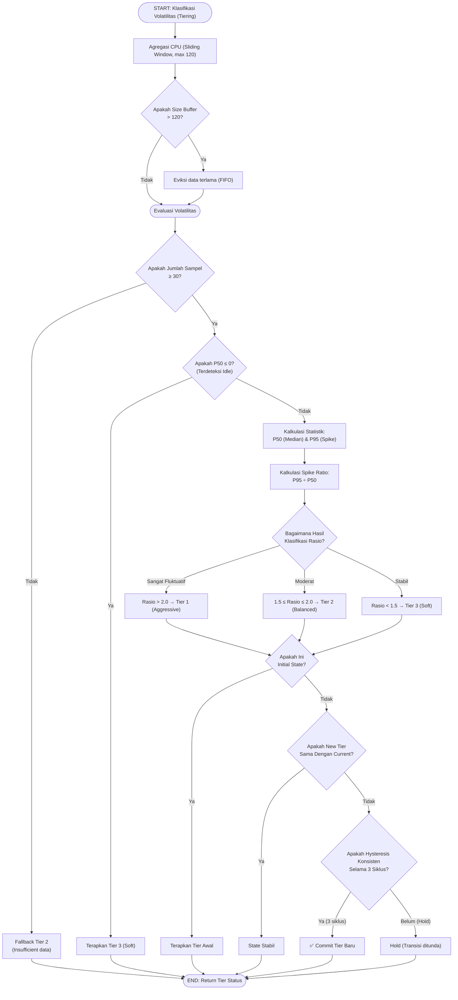

# Flowchart — TierDetector.get_tier() (Layer 3B)

> **Kode Sumber:** `framework/tier_detector.py` → class `TierDetector`, fungsi `add_sample()` (baris 26–31) dan `get_tier()` (baris 33–90)
> **Posisi di Diagram:** Layer 3 — Hybrid Control Engine → 3B Tier Detector (P95/P50)
> **Kategori:** 🌟 INOVASI ALGORITMA (S2)

Algoritma **Dual-Window Volatility Classification** menggunakan rasio persentil P95/P50 dalam Short Window (10 sampel) untuk deteksi burst cepat, dan Long Window (60 sampel) untuk tren baseline. Ditambah mekanisme **Asymmetric Hysteresis** (naik cepat, turun lambat) untuk mencegah osilasi tier.

```mermaid
flowchart TD
    START(["TierDetector (per container)"])

    ADD["add_sample(cpu)<br/>Append ke short_window & long_window"]
    TRIM{"len(long)<br/>> 60?"}
    POP["long.pop(0)<br/>short.pop(0)"]

    GET_TIER(["get_tier(container_name)"])

    COLD{"len(long)<br/>< 10?"}
    COLD_FALLBACK["Return Tier 2<br/>(Warmup)"]
    
    FAST_PATH{"Short Window<br/>len ≥ 5 & spike_ratio > 2.0?"}
    FAST_ESCALATE["Bypass Hysteresis:<br/>Escalate Immediate (Tier 1)"]

    CALC_P50["p50 = numpy.percentile(long, 50)<br/><i>Median</i>"]
    CALC_P95["p95 = numpy.percentile(long, 95)<br/><i>Spike</i>"]

    P50_ZERO{"p50 ≤ 0?<br/>(idle)"}
    IDLE_SOFT["Return Tier 3 (Soft)"]

    CALC_RATIO["spike_ratio = p95 / p50"]

    CLASSIFY{"Klasifikasi<br/>spike_ratio"}
    TIER1["raw_tier = 1 (Aggressive)<br/>spike_ratio > 2.0"]
    TIER2["raw_tier = 2 (Balanced)<br/>1.5 ≤ spike_ratio ≤ 2.0"]
    TIER3["raw_tier = 3 (Soft)<br/>spike_ratio < 1.5"]

    HYST_INIT{"State = Null?"}
    INIT_STATE["Init hysteresis state:<br/>current = raw_tier<br/>pending = raw_tier<br/>count = 3"]
    RETURN_RAW(["Return raw_tier"])

    SAME_CURRENT{"raw_tier ==<br/>state.current?"}
    RESET_PENDING["Reset pending transition<br/>count = 0"]
    RETURN_CURRENT1(["Return state.current"])

    SAME_PENDING{"raw_tier ==<br/>state.pending?"}
    INC_COUNT["state.count += 1"]
    
    DIRECTION{"Tentukan Arah Transisi:<br/>Escalation atau De-escalation"}
    THRESH_EVAL["threshold = 1 (Escalate)<br/>threshold = 5 (De-escalate)"]
    
    COUNT_MET{"count ≥ threshold?"}
    COMMIT["✅ Commit transisi tier:<br/>state.current = raw_tier<br/>count = 0"]
    RETURN_NEW(["Return raw_tier (baru)"])
    HOLD(["Return state.current<br/>(Hold)"])

    NEW_PENDING["state.pending = raw_tier<br/>state.count = 1"]
    RETURN_HOLD(["Return state.current<br/>(Hold)"])

    START --> ADD
    ADD --> TRIM
    TRIM -->|Ya| POP
    TRIM -->|Tidak| GET_TIER
    POP --> GET_TIER

    GET_TIER --> COLD
    COLD -->|"Ya (< 10)"| COLD_FALLBACK
    COLD -->|"Tidak (≥ 10)"| FAST_PATH
    
    FAST_PATH -->|Ya| FAST_ESCALATE
    FAST_PATH -->|Tidak| CALC_P50

    CALC_P50 --> CALC_P95
    CALC_P95 --> P50_ZERO
    P50_ZERO -->|Ya| IDLE_SOFT
    P50_ZERO -->|Tidak| CALC_RATIO
    CALC_RATIO --> CLASSIFY

    CLASSIFY -->|"ratio > 2.0"| TIER1
    CLASSIFY -->|"1.5 ≤ ratio ≤ 2.0"| TIER2
    CLASSIFY -->|"ratio < 1.5"| TIER3

    TIER1 --> HYST_INIT
    TIER2 --> HYST_INIT
    TIER3 --> HYST_INIT

    HYST_INIT -->|Ya| INIT_STATE
    INIT_STATE --> RETURN_RAW
    HYST_INIT -->|Tidak| SAME_CURRENT

    SAME_CURRENT -->|Ya| RESET_PENDING
    RESET_PENDING --> RETURN_CURRENT1

    SAME_CURRENT -->|Tidak| SAME_PENDING
    SAME_PENDING -->|Ya| INC_COUNT
    INC_COUNT --> DIRECTION
    DIRECTION --> THRESH_EVAL
    THRESH_EVAL --> COUNT_MET
    COUNT_MET -->|"Ya (≥ threshold)"| COMMIT
    COMMIT --> RETURN_NEW
    COUNT_MET -->|Tidak| HOLD

    SAME_PENDING -->|Tidak| NEW_PENDING
    NEW_PENDING --> RETURN_HOLD
```

## Mengapa Ini Inovasi S2?

1. **Dual-Window Architecture:** Short window (10) mendeteksi burst langsung, Long window (60) menilai tren baseline. Fast-path escalation memotong antrean.
2. **P95/P50 Spike Ratio:** Bukan menggunakan rata-rata (mean) yang sensitif terhadap outlier. Rasio persentil ini adalah metode statistik robust untuk mendeteksi *burstiness* beban kerja web secara real-time.
3. **Asymmetric Hysteresis:** Algoritma anti-osilasi asimetris — eskalasi (ancaman naik) cepat hanya 1 sampel, de-eskalasi (beban turun) butuh konfirmasi lambat 5 sampel berturut-turut. Mencegah *flapping* dan pelepasan prematur.

---

## Alur Logika Konseptual

