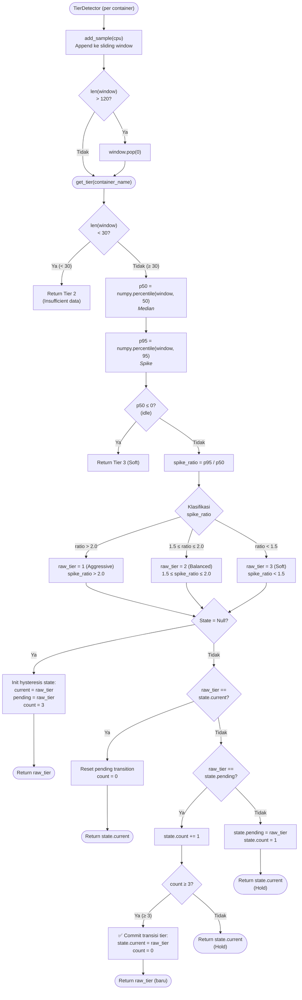
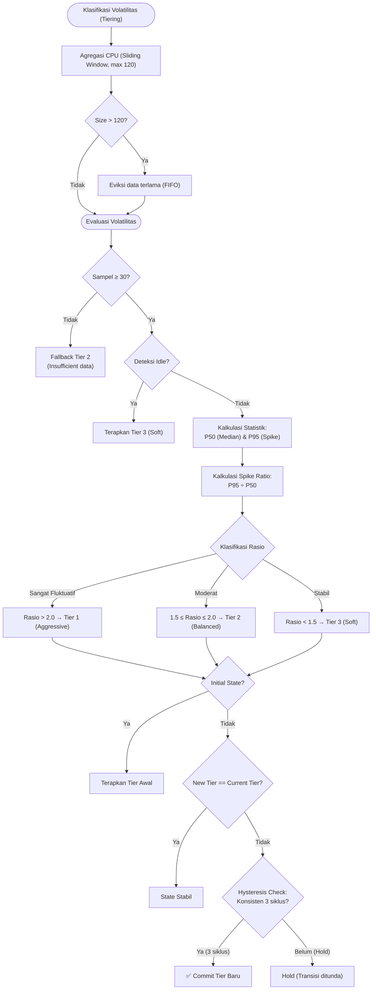

# Flowchart — TierDetector.get_tier() (Layer 3B)

> **Kode Sumber:** `framework/tier_detector.py` → class `TierDetector`, fungsi `add_sample()` (baris 26–31) dan `get_tier()` (baris 33–90)
> **Posisi di Diagram:** Layer 3 — Hybrid Control Engine → 3B Tier Detector (P95/P50)
> **Kategori:** 🌟 INOVASI ALGORITMA (S2)

Algoritma **Statistical Volatility Classification** menggunakan rasio persentil P95/P50 dalam sliding window 120 sampel. Ditambah mekanisme **Hysteresis** untuk mencegah osilasi antar tier.

## Mengapa Ini Inovasi S2?

1. **P95/P50 Spike Ratio:** Bukan menggunakan rata-rata (mean) yang sensitif terhadap outlier. Rasio persentil ini adalah metode statistik robust untuk mendeteksi *burstiness* beban kerja web secara real-time.
2. **Sliding Window 120 Sampel:** Memberikan konteks historis yang cukup panjang tanpa mengonsumsi memori berlebih.
3. **Hysteresis (3 sampel stabil):** Algoritma anti-osilasi dari teori kontrol — tier baru hanya di-commit jika konsisten selama 3 evaluasi berturut-turut. Mencegah *flapping* yang menyebabkan overhead percuma.

---

## Alur Logika Konseptual

