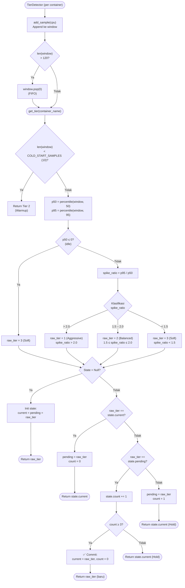

# Flowchart — TierDetector.get_tier() (Layer 3B)

> **Kode Sumber:** `framework/tier_detector.py` → class `TierDetector`, fungsi `add_sample()` dan `get_tier()`
> **Posisi di Diagram:** Layer 3 — Hybrid Control Engine → 3B Tier Detector (P95/P50)
> **Kategori:** 🌟 INOVASI ALGORITMA (S2)

Algoritma **Single-Window Volatility Classification** menggunakan rasio persentil P95/P50 pada satu sliding window (`TIER_WINDOW = 120` sampel), dengan **Symmetric Hysteresis** (`TIER_HYSTERESIS_SAMPLES = 3`) untuk mencegah osilasi tier.

> **Revisi pasca-eksperimen:** versi sebelumnya (Dual-Window + hysteresis asimetris 1/5 sampel) menahan throttle terlalu lama setelah spike berakhir (5 sampel × 10–30 detik), sehingga P95 saat Spike melampaui SLA 500 ms dan throughput turun ±33%. Desain disederhanakan agar rilis lebih cepat dan selaras dengan `config.py`.

```mermaid
flowchart TD
    START(["TierDetector (per container)"])

    ADD["add_sample(cpu)<br/>Append ke window"]
    TRIM{"len(window)<br/>> 120?"}
    POP["window.pop(0)<br/>(FIFO)"]

    GET_TIER(["get_tier(container_name)"])

    COLD{"len(window)<br/>< COLD_START_SAMPLES (10)?"}
    COLD_FALLBACK["Return Tier 2<br/>(Warmup)"]

    CALC["p50 = percentile(window, 50)<br/>p95 = percentile(window, 95)"]

    P50_ZERO{"p50 ≤ 0?<br/>(idle)"}
    IDLE_SOFT["raw_tier = 3 (Soft)"]

    CALC_RATIO["spike_ratio = p95 / p50"]

    CLASSIFY{"Klasifikasi<br/>spike_ratio"}
    TIER1["raw_tier = 1 (Aggressive)<br/>spike_ratio > 2.0"]
    TIER2["raw_tier = 2 (Balanced)<br/>1.5 ≤ spike_ratio ≤ 2.0"]
    TIER3["raw_tier = 3 (Soft)<br/>spike_ratio < 1.5"]

    HYST_INIT{"State = Null?"}
    INIT_STATE["Init state:<br/>current = pending = raw_tier"]
    RETURN_RAW(["Return raw_tier"])

    SAME_CURRENT{"raw_tier ==<br/>state.current?"}
    RESET_PENDING["pending = raw_tier<br/>count = 0"]
    RETURN_CURRENT1(["Return state.current"])

    SAME_PENDING{"raw_tier ==<br/>state.pending?"}
    INC_COUNT["state.count += 1"]
    COUNT_MET{"count ≥ 3?"}
    COMMIT["✅ Commit:<br/>current = raw_tier, count = 0"]
    RETURN_NEW(["Return raw_tier (baru)"])
    HOLD(["Return state.current (Hold)"])

    NEW_PENDING["pending = raw_tier<br/>count = 1"]
    RETURN_HOLD(["Return state.current (Hold)"])

    START --> ADD --> TRIM
    TRIM -->|Ya| POP --> GET_TIER
    TRIM -->|Tidak| GET_TIER

    GET_TIER --> COLD
    COLD -->|Ya| COLD_FALLBACK
    COLD -->|Tidak| CALC --> P50_ZERO
    P50_ZERO -->|Ya| IDLE_SOFT --> HYST_INIT
    P50_ZERO -->|Tidak| CALC_RATIO --> CLASSIFY

    CLASSIFY -->|"> 2.0"| TIER1 --> HYST_INIT
    CLASSIFY -->|"1.5 – 2.0"| TIER2 --> HYST_INIT
    CLASSIFY -->|"< 1.5"| TIER3 --> HYST_INIT

    HYST_INIT -->|Ya| INIT_STATE --> RETURN_RAW
    HYST_INIT -->|Tidak| SAME_CURRENT
    SAME_CURRENT -->|Ya| RESET_PENDING --> RETURN_CURRENT1
    SAME_CURRENT -->|Tidak| SAME_PENDING
    SAME_PENDING -->|Ya| INC_COUNT --> COUNT_MET
    COUNT_MET -->|Ya| COMMIT --> RETURN_NEW
    COUNT_MET -->|Tidak| HOLD
    SAME_PENDING -->|Tidak| NEW_PENDING --> RETURN_HOLD
```

## Mengapa Ini Inovasi S2?

1. **P95/P50 Spike Ratio:** Bukan menggunakan rata-rata (mean) yang sensitif terhadap outlier. Rasio persentil adalah metode statistik robust untuk mendeteksi *burstiness* beban kerja web secara real-time.
2. **Symmetric Hysteresis (3 sampel):** Anti-osilasi sederhana dan cepat. Perpindahan tier (naik maupun turun) butuh 3 sampel berturut-turut, sehingga pelepasan throttle setelah spike tidak tertahan lama (memperbaiki pelanggaran SLA pada Spike).
3. **Kompleksitas:** `np.percentile` pada window ≤120 sampel per container; memori O(120 × N_container).

> **Catatan optimasi lanjutan:** `np.percentile` dapat diganti P² quantile estimator (O(1) memori) bila overhead perlu ditekan lebih jauh.
