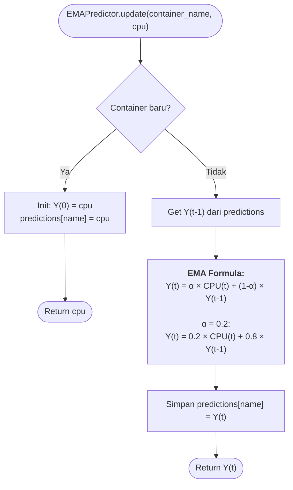
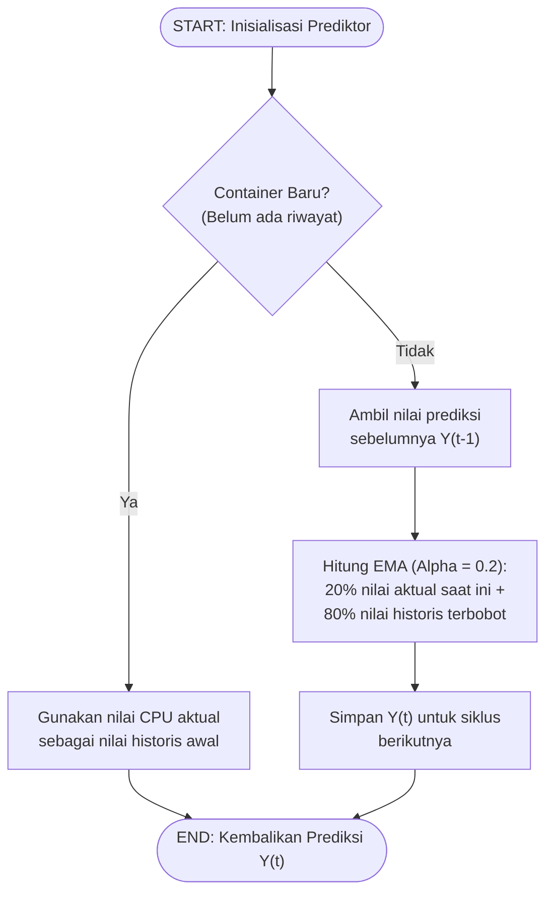

# Flowchart — EMAPredictor.update() (Layer 3C)

> **Kode Sumber:** `framework/predictor.py` → class `EMAPredictor`, fungsi `update()` (baris 15–29)
> **Posisi di Diagram:** Layer 3 — Hybrid Control Engine → 3C EMA Predictor (α=0.2)
> **Kategori:** 🌟 INOVASI ALGORITMA (S2)

Algoritma **Proactive Time-Series Forecasting** menggunakan Exponential Moving Average dengan memori O(1). Hanya menyimpan satu nilai per container (Y(t-1)) — sangat ringan. Hasilnya digunakan untuk menyesuaikan sensitivitas Guardrail secara proaktif.

---

## Integrasi EMA → Guardrail (3C → 3A)

> **Kode Sumber:** `framework/guardrail.py` → `_get_effective_cpu_threshold()` (baris 67–85)

## Mengapa Ini Inovasi S2?

1. **O(1) Memory Complexity:** Hanya menyimpan satu float per container. Tidak ada array historis, tidak ada model ML, tidak ada dependency berat.
2. **Proactive, Bukan Reactive:** EMA memprediksi tren *sebelum* CPU benar-benar melewati threshold, memberikan jeda waktu 1–2 sampel bagi Guardrail untuk bertindak lebih awal.
3. **Anti-ML by Design:** Tesis ini secara sadar menolak ML/DL karena justru akan menambah konsumsi energi (menyalahi tujuan penelitian). EMA adalah solusi matematis yang optimal untuk constraint ini.

---

## Alur Logika Konseptual

### Forecasting Utilisasi Beban

### Integrasi EMA → Guardrail

