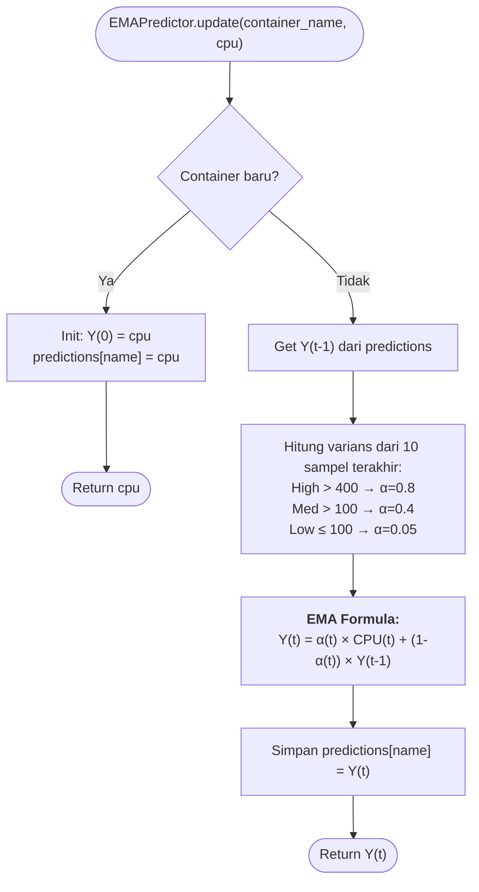
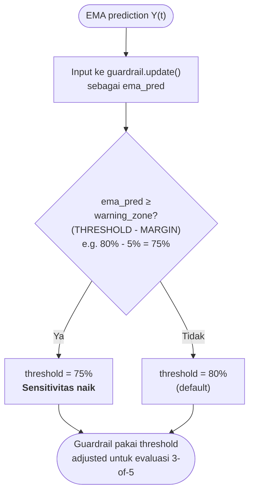
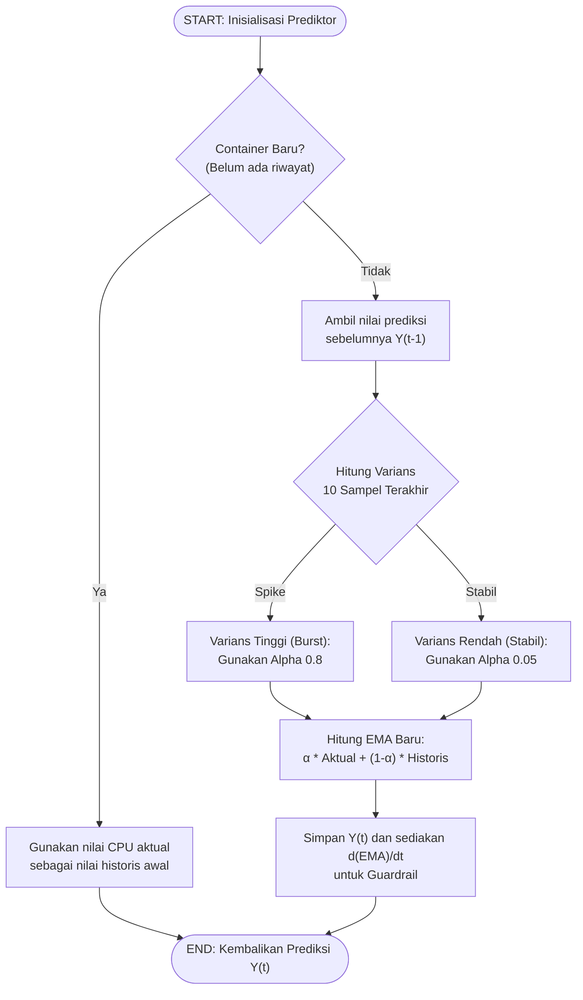
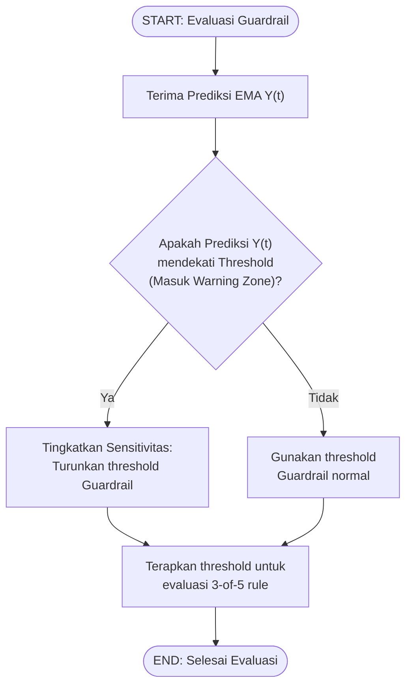

# Flowchart — EMAPredictor.update() (Layer 3C)

> **Kode Sumber:** `framework/predictor.py` → class `EMAPredictor`, fungsi `update()` (baris 15–29)
> **Posisi di Diagram:** Layer 3 — Hybrid Control Engine → 3C EMA Predictor (Adaptive α)
> **Kategori:** 🌟 INOVASI ALGORITMA (S2)

Algoritma **Proactive Time-Series Forecasting** menggunakan Exponential Moving Average dengan *Adaptive Alpha* berdasarkan varians CPU. Alpha bergeser dinamis antara 0.05 (stabil) hingga 0.8 (lonjakan) untuk pelacakan cepat. Hasilnya (dan turunannya d(EMA)/dt) digunakan untuk memicu pemotongan proaktif di Guardrail.

---

## Integrasi EMA → Guardrail (3C → 3A)

> **Kode Sumber:** `framework/guardrail.py` → `_get_effective_cpu_threshold()` (baris 67–85)

## Mengapa Ini Inovasi S2?

1. **Adaptive Alpha:** Tidak lagi terjebak trade-off antara noise vs responsiveness. Saat stabil α=0.05 (menekan noise), saat ada burst α=0.8 (bereaksi 16× lebih cepat).
2. **Derivative-Based Proactivity:** Menghasilkan sinyal d(EMA)/dt yang memungkinkan Guardrail memotong spike *sebelum* CPU mencapai limit atas, menekan kemungkinan OOM/starvation di level host.
3. **Anti-ML by Design:** Tesis ini secara sadar menolak ML/DL karena justru akan menambah konsumsi energi (menyalahi tujuan penelitian). EMA + Varians adalah solusi matematis yang ringan namun sangat optimal.

---

## Alur Logika Konseptual

### Forecasting Utilisasi Beban

### Integrasi EMA → Guardrail

