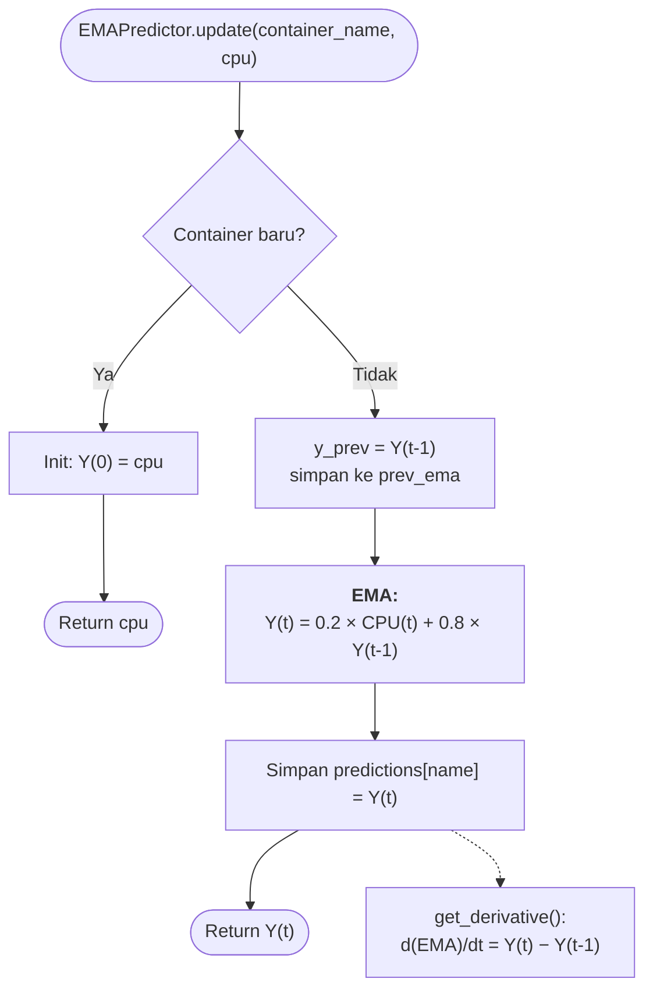
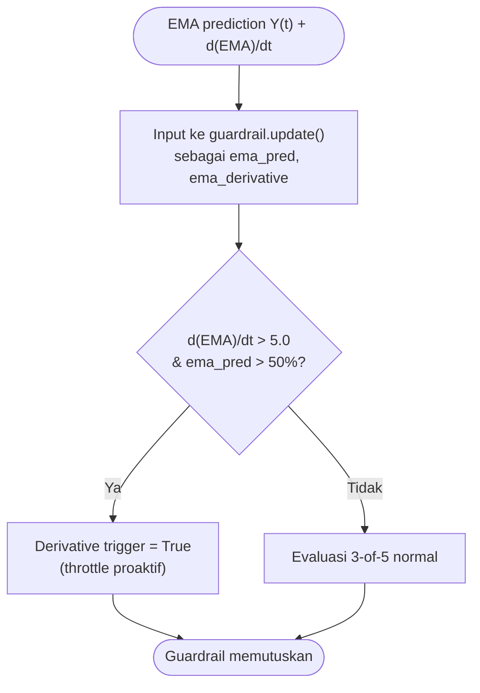

# Flowchart — EMAPredictor.update() (Layer 3C)

> **Kode Sumber:** `framework/predictor.py` → class `EMAPredictor`, fungsi `update()` dan `get_derivative()`
> **Posisi di Diagram:** Layer 3 — Hybrid Control Engine → 3C EMA Predictor (α tetap 0.2)
> **Kategori:** 🌟 INOVASI ALGORITMA (S2)

Algoritma **Proactive Time-Series Forecasting** menggunakan Exponential Moving Average dengan **α tetap = 0.2** (sesuai PRD §11 dan proposal §3.2.4). Hasilnya dan turunannya `d(EMA)/dt = EMA(t) − EMA(t−1)` dipakai Guardrail untuk pemotongan proaktif.

> **Revisi pasca-eksperimen:** Adaptive Alpha (0.05–0.8 berbasis varians) dihapus. Di luar scope PRD, menambah kompleksitas, dan tidak terbukti memperbaiki hasil. Kini O(1) waktu dan O(1) memori per container.

```mermaid
flowchart TD
    START(["EMAPredictor.update(container_name, cpu)"])

    FIRST{"Container baru?"}
    INIT["Init: Y(0) = cpu"]
    RETURN_INIT(["Return cpu"])

    GET_PREV["y_prev = Y(t-1)<br/>simpan ke prev_ema"]

    CALC["<b>EMA:</b><br/>Y(t) = 0.2 × CPU(t) + 0.8 × Y(t-1)"]

    SAVE["Simpan predictions[name] = Y(t)"]
    RETURN(["Return Y(t)"])

    DERIV["get_derivative():<br/>d(EMA)/dt = Y(t) − Y(t-1)"]

    START --> FIRST
    FIRST -->|Ya| INIT --> RETURN_INIT
    FIRST -->|Tidak| GET_PREV --> CALC --> SAVE --> RETURN
    SAVE -.-> DERIV
```

---

## Integrasi EMA → Guardrail (3C → 3A)

> **Kode Sumber:** `framework/guardrail.py` → `update()` (derivative pre-emptive trigger)

```mermaid
flowchart TD
    EMA_INPUT(["EMA prediction Y(t) + d(EMA)/dt"])
    FEED["Input ke guardrail.update()<br/>sebagai ema_pred, ema_derivative"]
    CHECK{"d(EMA)/dt > 5.0<br/>& ema_pred > 50%?"}
    TRIGGER["Derivative trigger = True<br/>(throttle proaktif)"]
    NORMAL["Evaluasi 3-of-5 normal"]
    RESULT([" Guardrail memutuskan"])

    EMA_INPUT --> FEED --> CHECK
    CHECK -->|Ya| TRIGGER --> RESULT
    CHECK -->|Tidak| NORMAL --> RESULT
```

## Mengapa Ini Inovasi S2?

1. **O(1) EMA, α tetap:** Tidak ada ML, tidak ada buffer varians. Mudah direproduksi dan dianalisis sensitivitasnya (±20% pada `EMA_ALPHA`).
2. **Derivative-Based Proactivity:** Sinyal `d(EMA)/dt` memungkinkan Guardrail memotong spike *sebelum* CPU menembus limit.
3. **Anti-ML by Design:** Tesis menolak ML/DL karena menambah konsumsi energi. EMA adalah solusi matematis ringan.
