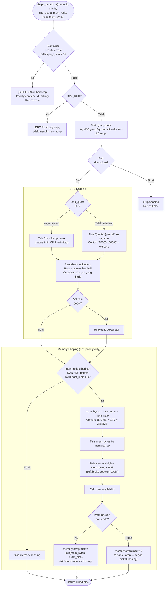
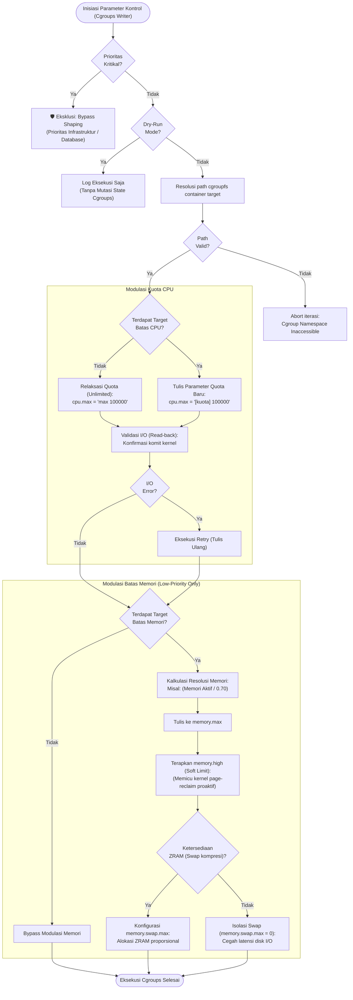

# Flowchart — shape_container() (Layer 4 — Cgroups Writer)

> **Kode Sumber:** `framework/shaper.py` → fungsi `shape_container()` (baris 33–81), `_write_cpu()` (baris 84–116), `_write_memory()` (baris 119–150)
> **Posisi di Diagram:** Layer 4 — Adaptive Resource Shaping → cpu.max, memory.max, memory.high, zram
> **Kategori:** Tools / Aktuator (S1)

Fungsi ini adalah **aktuator**. Ia tidak membuat keputusan — ia hanya mengeksekusi keputusan dari Layer 3. Menulis parameter ke file cgroups v2 di Linux kernel.

### Catatan
Meskipun ini dikategorikan sebagai Tools (S1), perhatikan bahwa **nilai yang ditulis** (`cpu_quota`, `mem_ratio`) berasal dari keputusan algoritmik Layer 3. Shaper hanyalah "tangan" yang mengeksekusi perintah "otak".

---

## Deskripsi Alur Berbasis Bisnis/Akademik

