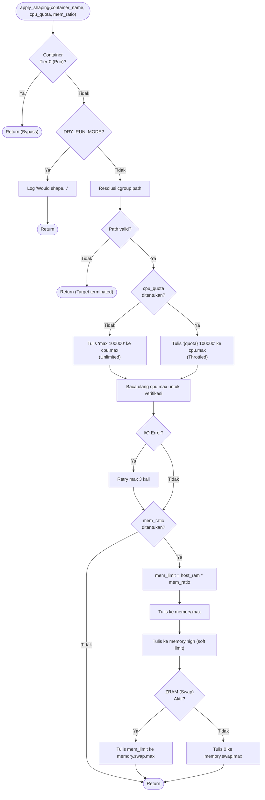
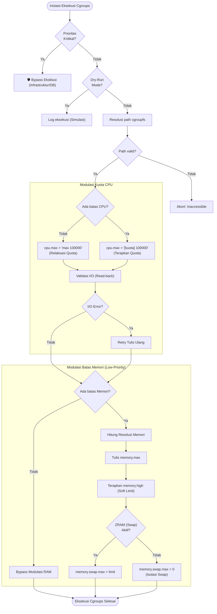

# Flowchart — Shaper.apply_shaping() (Layer 4)

> **Kode Sumber:** `framework/shaper.py` → class `ContainerShaper`, fungsi `apply_shaping()` (baris 31–123)
> **Posisi di Diagram:** Layer 4 — Adaptive Resource Shaping → 4A Cgroups Writer
> **Kategori:** 🛠️ TOOLS & INFRASTRUKTUR (S1)

Shaper bertugas sebagai eksekutor. Menerima input dari Layer 3 (Tier & Limit) dan menulisnya ke file `/sys/fs/cgroup/cpu.max` dan `memory.max`. Layer ini bersifat "bodoh", murni I/O bound.

## Catatan

Meskipun ini dikategorikan sebagai Tools (S1), perhatikan bahwa **nilai yang ditulis** (`cpu_quota`, `mem_ratio`) berasal dari keputusan algoritmik Layer 3. Shaper hanyalah "tangan" yang mengeksekusi perintah "otak".

---

## Alur Logika Konseptual

