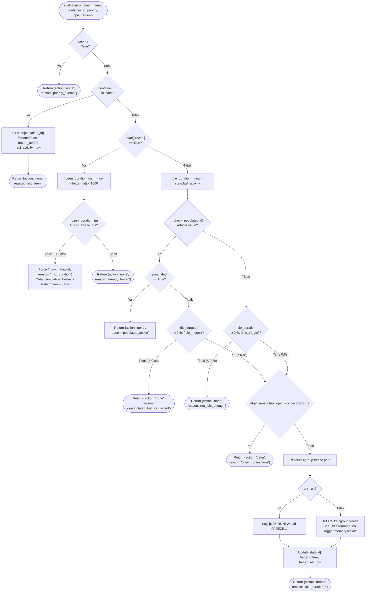
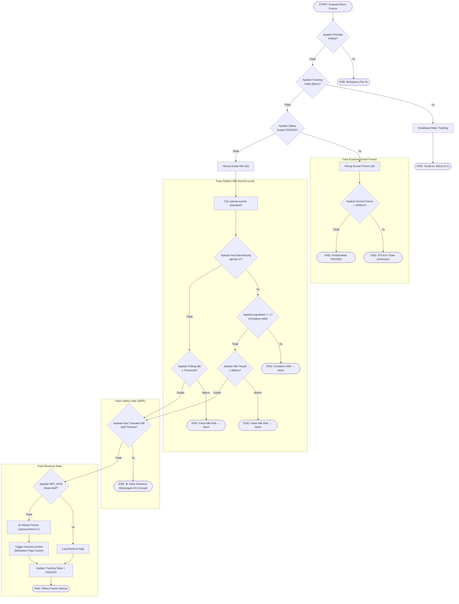

# Flowchart — MicroFreezer.evaluate() (Layer 4)

> **Kode Sumber:** `framework/security/micro_freezer.py` → class `MicroFreezer`, fungsi `evaluate()` (baris 78–145) dan `record_activity()` (baris 62–76)
> **Posisi di Diagram:** Layer 4 — Adaptive Resource Shaping → 4B Micro-Freezer
> **Kategori:** 🌟 INOVASI ALGORITMA (S2)

Algoritma pembekuan container tingkat milidetik (`cgroup.freeze`). Dioptimasi untuk mereduksi konsumsi CPU idle ke absolute 0% tanpa memutus koneksi TCP. Menggunakan eBPF untuk mendeteksi transaksi yang sedang berjalan (Safety Gate) dan `cgroup.events` untuk deteksi idle. Terintegrasi dengan **Active Memory Reclaim** (`memory.reclaim`) untuk membebaskan page cache saat idle.

## Mengapa Ini Inovasi S2?

1. **Event-Driven vs Polling:** Idle detection menggunakan sinyal kernel (`cgroup.events populated=0`) — bukan polling CPU%. Ini menghilangkan false-idle dan false-active antar interval sampling. Waktu tunggu ditekan menjadi 0.8s untuk memaksimalkan capture state idle.
2. **Literal 0% CPU:** Tidak ada teknik cgroups throttling yang bisa mencapai 0% CPU. Hanya `cgroup.freeze` yang bisa — dan ini eksklusif cgroups v2.
3. **Active Memory Reclaim:** Tidak hanya menghemat CPU, pembekuan otomatis memicu `memory.reclaim` (kernel ≥ 6.1) untuk menekan footprint RAM container yang sedang idle tanpa membunuhnya.
4. **Safety Gate (eBPF):** Sebelum freeze, mengecek apakah ada transaksi database yang belum selesai. Mencegah data corruption.
5. **Hard Duration Cap:** Freeze dibatasi 500–1000ms per siklus. Dikombinasikan dengan TCP Backlog buffering (lihat flowchart berikutnya). Durasi freeze ini diakumulasikan dan dilacak per container untuk perhitungan energi.

---

## Alur Logika Konseptual

