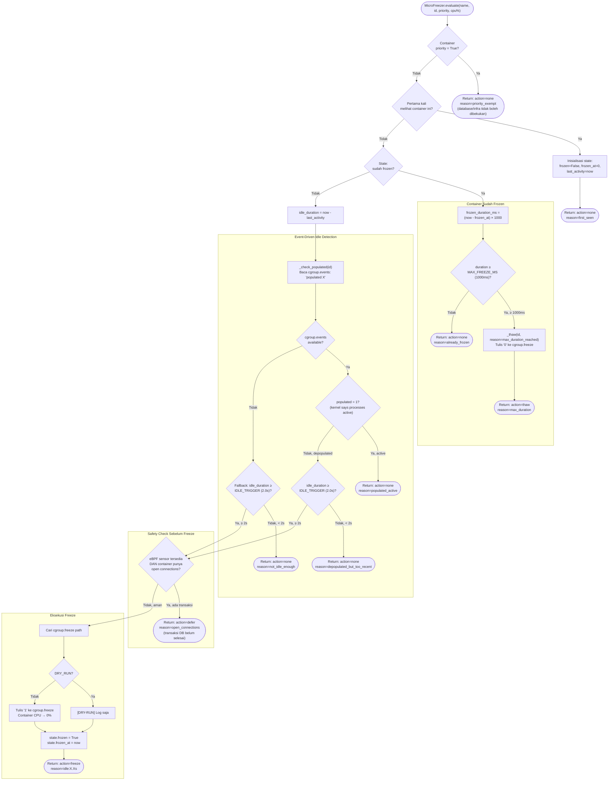

# Flowchart — MicroFreezer.evaluate() (Layer 4 Extension)

> **Kode Sumber:** `framework/security/micro_freezer.py` → class `MicroFreezer`, fungsi `evaluate()` (baris 78–145), `_freeze()` (baris 147–166), `_thaw()` (baris 168–188), `_check_populated()` (baris 221–237)
> **Posisi di Diagram:** Layer 4 — Adaptive Resource Shaping → Micro-Freezing
> **Kategori:** 🌟 INOVASI ALGORITMA (S2)

Algoritma **Event-Driven Micro-Freezing** yang mendeteksi idle state container melalui sinyal kernel (`cgroup.events populated=0`), lalu menulis `cgroup.freeze=1` untuk menjatuhkan CPU ke **literal 0%** tanpa mematikan container.



### Mengapa Ini Inovasi S2?
1. **Event-Driven vs Polling:** Idle detection menggunakan sinyal kernel (`cgroup.events populated=0`) — bukan polling CPU%. Ini menghilangkan false-idle dan false-active antar interval sampling.
2. **Literal 0% CPU:** Tidak ada teknik cgroups throttling yang bisa mencapai 0% CPU. Hanya `cgroup.freeze` yang bisa — dan ini eksklusif cgroups v2.
3. **Safety Gate (eBPF):** Sebelum freeze, mengecek apakah ada transaksi database yang belum selesai. Mencegah data corruption.
4. **Hard Duration Cap:** Freeze dibatasi 500–1000ms per siklus. Dikombinasikan dengan TCP Backlog buffering (lihat flowchart berikutnya).

---

## Deskripsi Alur Berbasis Bisnis/Akademik

```mermaid
flowchart TD
    START(["Evaluasi Kelayakan Micro-Freeze"])

    PENTING{"Validasi Prioritas<br/>Target Container?"}
    TIDAK_BOLEH(["❌ Eksekusi Ditolak<br/>(Bypass: Layanan Kritikal / Tier-0)"])

    BARU{"Status Tracking<br/>Initial (New)?"}
    CATAT_BARU["Inisialisasi State Tracking<br/>(Insufficient Data)"]
    PERTAMA_SELESAI(["Tunda eksekusi ke siklus (t+1)"])

    SUDAH_BEKU{"Status Aktif ==<br/>FROZEN?"}

    subgraph CEK_DURASI["Fase Evaluasi Durasi Freeze"]
        BERAPA_LAMA["Kalkulasi Durasi Freeze Aktual<br/>(Δt = Waktu Sekarang - Waktu Freeze)"]
        TERLALU_LAMA{"Durasi > Ambang Batas<br/>Maksimal (1000ms)?"}
        BANGUNKAN["⏰ Inisiasi Force-Thaw (Unfreeze)<br/>(Mitigasi risiko koneksi TCP putus)"]
        MASIH_OK(["Durasi Optimal<br/>(Pertahankan status FROZEN)"])
    end

    HITUNG_IDLE["Kalkulasi Durasi Idle (Δt sejak aktivitas terakhir)"]

    subgraph DETEKSI["Fase Deteksi Idle Berbasis Event (Kernel-Level)"]
        TANYA_KERNEL["Interogasi cgroup.events:<br/>Sinyal 'populated' dari Kernel"]
        BISA_TANYA{"Integritas<br/>cgroup v2?"}

        AKTIF{"Sinyal 'populated' == 1?<br/>(Terdapat proses aktif)"}
        BELUM_IDLE(["Container Aktif: Abort Freeze"])

        CUKUP_LAMA{"Durasi Idle ≥<br/>Trigger Threshold (2000ms)?"}
        BARU_SAJA(["Transisi terlalu dini<br/>(Risiko False-Idle)"])

        FALLBACK{"Fallback (Polling):<br/>Durasi Idle ≥ Threshold?"}
        BARU_SAJA2(["Transisi terlalu dini<br/>(Risiko False-Idle)"])
    end

    subgraph KEAMANAN["Fase Verifikasi Safety Gate (eBPF)"]
        CEK_TRANSAKSI{"Monitoring Koneksi Terbuka:<br/>Terdapat Transaksi Aktif?"}
        TUNDA(["⏸️ Defer Eksekusi<br/>(Menghindari korupsi data / interupsi I/O)"])
    end

    subgraph BEKUKAN["Fase Eksekusi State Mutation"]
        SIMULASI{"Dry-Run<br/>Mode?"}
        CATAT_SAJA["Log Eksekusi Saja (Simulasi)"]
        TULIS_BEKU["❄️ Inisiasi Freeze (Commit):<br/>Tulis '1' ke cgroup.freeze<br/>(Reduksi CPU → 0% seketika<br/>dengan Resume Latency < 1ms)"]
        TANDAI["Perbarui Tracking State = FROZEN"]
        BEKU_SELESAI(["Siklus Freeze Selesai<br/>(Energi Berhasil Dihemat)"])
    end

    START --> PENTING
    PENTING -->|Ya| TIDAK_BOLEH
    PENTING -->|Tidak| BARU
    BARU -->|Ya| CATAT_BARU
    CATAT_BARU --> PERTAMA_SELESAI
    BARU -->|Tidak| SUDAH_BEKU

    SUDAH_BEKU -->|Ya| BERAPA_LAMA
    BERAPA_LAMA --> TERLALU_LAMA
    TERLALU_LAMA -->|Ya| BANGUNKAN
    TERLALU_LAMA -->|Tidak| MASIH_OK

    SUDAH_BEKU -->|Tidak| HITUNG_IDLE
    HITUNG_IDLE --> TANYA_KERNEL
    TANYA_KERNEL --> BISA_TANYA

    BISA_TANYA -->|Ya| AKTIF
    AKTIF -->|Ya (Aktif)| BELUM_IDLE
    AKTIF -->|Tidak (Idle)| CUKUP_LAMA
    CUKUP_LAMA -->|Belum| BARU_SAJA
    CUKUP_LAMA -->|Sudah| CEK_TRANSAKSI

    BISA_TANYA -->|Tidak| FALLBACK
    FALLBACK -->|Belum| BARU_SAJA2
    FALLBACK -->|Sudah| CEK_TRANSAKSI

    CEK_TRANSAKSI -->|Ya, Terbuka| TUNDA
    CEK_TRANSAKSI -->|Tidak, Aman| SIMULASI

    SIMULASI -->|Ya| CATAT_SAJA
    SIMULASI -->|Tidak| TULIS_BEKU
    CATAT_SAJA --> TANDAI
    TULIS_BEKU --> TANDAI
    TANDAI --> BEKU_SELESAI
```
