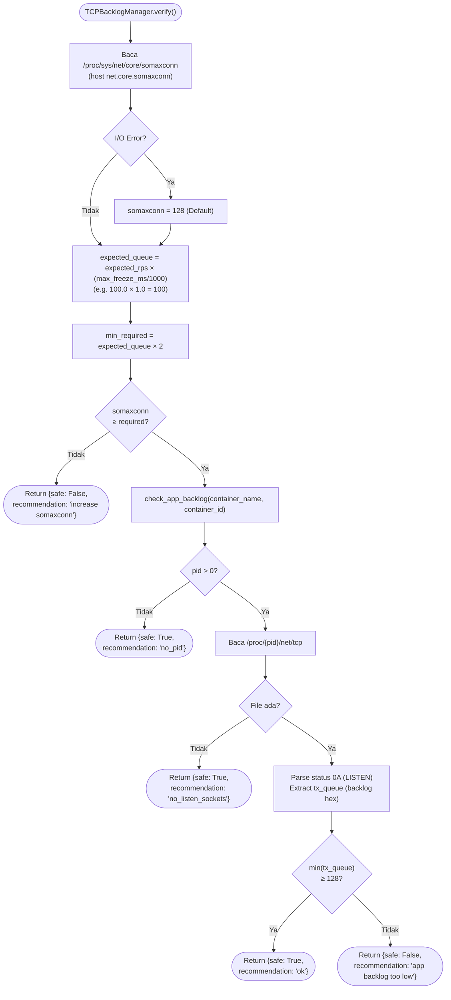
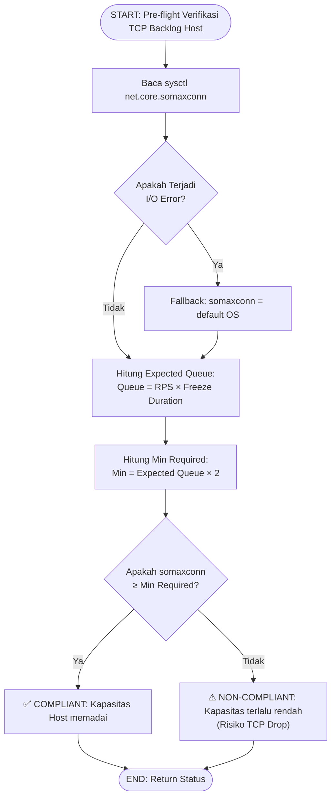
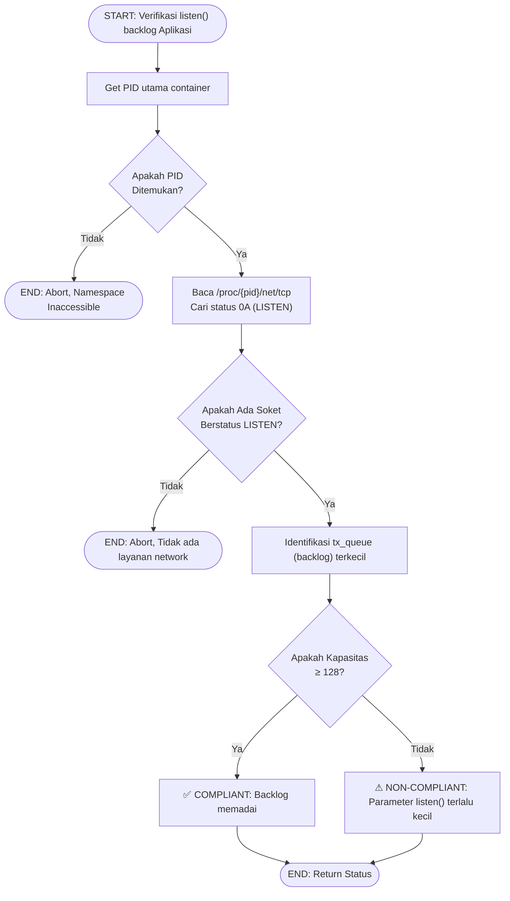

# Flowchart — TCPBacklogManager.verify() (Layer 4)

> **Kode Sumber:** `framework/security/tcp_backlog_manager.py` → class `TCPBacklogManager`, fungsi `verify()` (baris 67–115) dan `check_app_backlog()` (baris 128–193)
> **Posisi di Diagram:** Layer 4 — Adaptive Resource Shaping → 4B Micro-Freezer (Safety Pre-flight)
> **Kategori:** 🌟 INOVASI ALGORITMA (S2)

Mekanisme verifikasi *Network-Buffer-Aware* yang memungkinkan Micro-Freezing. Memastikan bahwa selama container di-freeze (500–1000ms), koneksi HTTP/TCP baru yang masuk tidak akan di-drop oleh kernel, melainkan ditampung di antrean (backlog) sampai container di-thaw.

## Mengapa Ini Inovasi S2?

1. **Menyelesaikan Masalah Fundamental:** Micro-Freezing hanya berguna jika koneksi tidak putus saat container frozen. Tanpa verifikasi backlog, freeze bisa lebih merusak daripada throttling biasa.
2. **Dua Level Verifikasi:** Sistem mengecek BAIK kernel-level (`somaxconn`) MAUPUN app-level (`listen()` backlog) — karena aplikasi yang dikompilasi dengan `listen(fd, 5)` tetap akan drop koneksi meskipun somaxconn=4096.
3. **Matematik Kapasitas Antrean:** Secara eksplisit menghitung `expected_queue_depth = RPS × freeze_duration` — ini formula matematis yang menjembatani subsistem jaringan dengan subsistem pembekuan cgroups.

---

## Alur Logika Konseptual

### Verifikasi Kapasitas Antrean Kernel (Host Level)

### Verifikasi Antrean Soket (Application Level)

