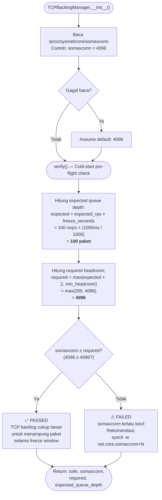
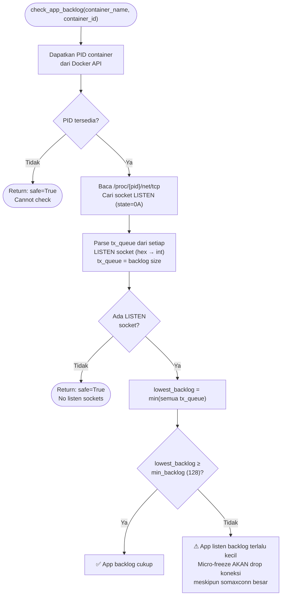
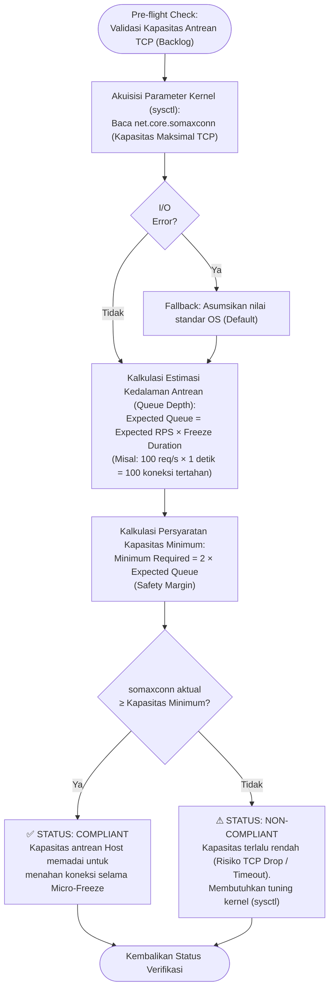
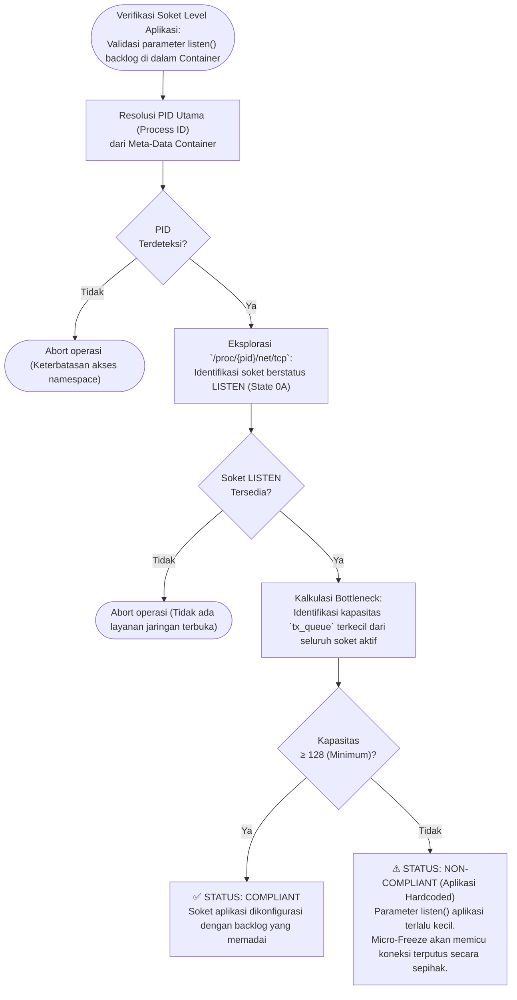

# Flowchart — TCPBacklogManager.verify() (Layer 4 Extension)

> **Kode Sumber:** `framework/security/tcp_backlog_manager.py` → class `TCPBacklogManager`, fungsi `verify()` (baris 67–115) dan `check_app_backlog()` (baris 128–193)
> **Posisi di Diagram:** Layer 4 — Adaptive Resource Shaping → TCP Backlog
> **Kategori:** 🌟 INOVASI ALGORITMA (S2)

Algoritma **TCP Backlog Capacity Verification** yang dijalankan saat cold-start. Menghitung apakah antrean TCP host cukup besar untuk menampung paket selama freeze window, sehingga koneksi pengguna **tidak putus** meskipun container sedang frozen (menjaga SLA).

---

## Flowchart — check_app_backlog() (App-Level Listen Backlog)

> **Kode Sumber:** `framework/security/tcp_backlog_manager.py` → `check_app_backlog()` (baris 128–193)

### Mengapa Ini Inovasi S2?
1. **Menyelesaikan Masalah Fundamental:** Micro-Freezing hanya berguna jika koneksi tidak putus saat container frozen. Tanpa verifikasi backlog, freeze bisa lebih merusak daripada throttling biasa.
2. **Dua Level Verifikasi:** Sistem mengecek BAIK kernel-level (`somaxconn`) MAUPUN app-level (`listen()` backlog) — karena aplikasi yang dikompilasi dengan `listen(fd, 5)` tetap akan drop koneksi meskipun somaxconn=4096.
3. **Matematik Kapasitas Antrean:** Secara eksplisit menghitung `expected_queue_depth = RPS × freeze_duration` — ini formula matematis yang menjembatani subsistem jaringan dengan subsistem pembekuan cgroups.

---

## Deskripsi Alur Berbasis Bisnis/Akademik

### Verifikasi Kapasitas Antrean Kernel (Host Level)

### Verifikasi Antrean Soket (Application Level)

