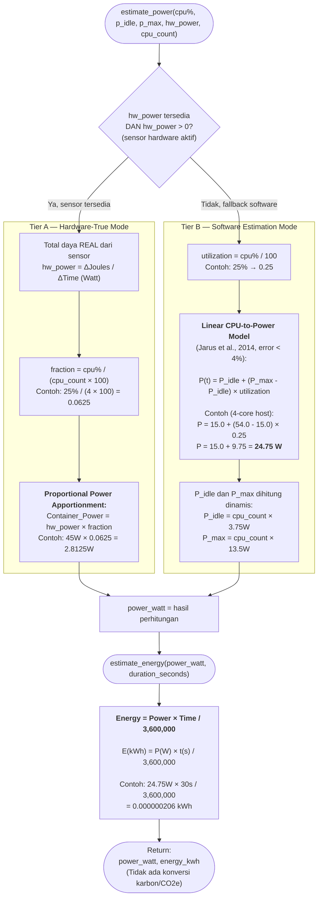
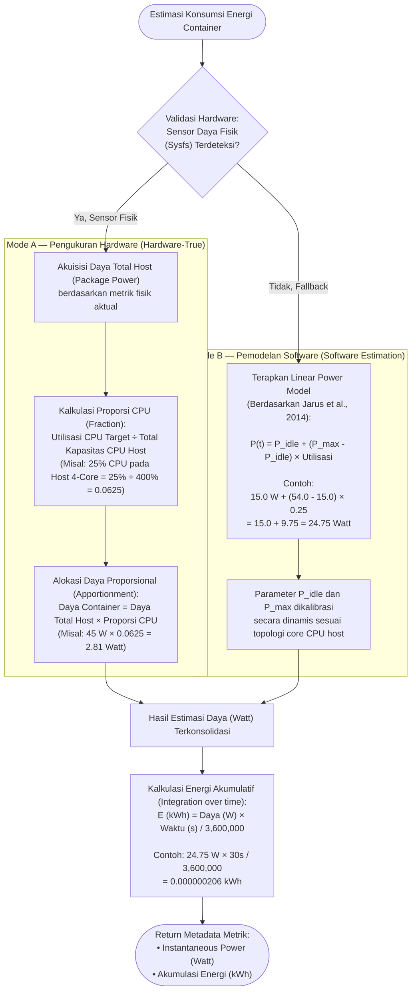

# Flowchart — Hybrid Energy Estimator

> **Kode Sumber:** `framework/energy.py` → fungsi `estimate_power()` (baris 7–21), `estimate_energy()` (baris 24–26), `estimate_all()` (baris 29–36)
> **Posisi di Diagram:** Supplementary Services → Energy Estimator
> **Kategori:** 🌟 INOVASI MODEL MATEMATIKA (S2)

Model **Hybrid Hardware/Software Energy Estimation** dengan algoritma **Proportional Power Apportionment** untuk mengalokasikan konsumsi daya total host ke masing-masing container secara proporsional.

### Mengapa Ini Inovasi S2?
1. **Hybrid Adaptive Model:** Secara otomatis mendeteksi dan memilih mode terbaik (hardware atau software) tanpa konfigurasi manual.
2. **Proportional Power Apportionment:** Sensor hardware hanya melaporkan total daya CPU package. Algoritma ini secara matematis membagi total tersebut ke setiap container berdasarkan proporsi penggunaan CPU mereka.
3. **Self-Calibrating:** P_idle dan P_max bukan konstanta tetap — mereka dihitung secara dinamis dari jumlah core fisik host, sehingga model skala otomatis dari 2-core hingga 16-core.

---

## Deskripsi Alur Berbasis Bisnis/Akademik

