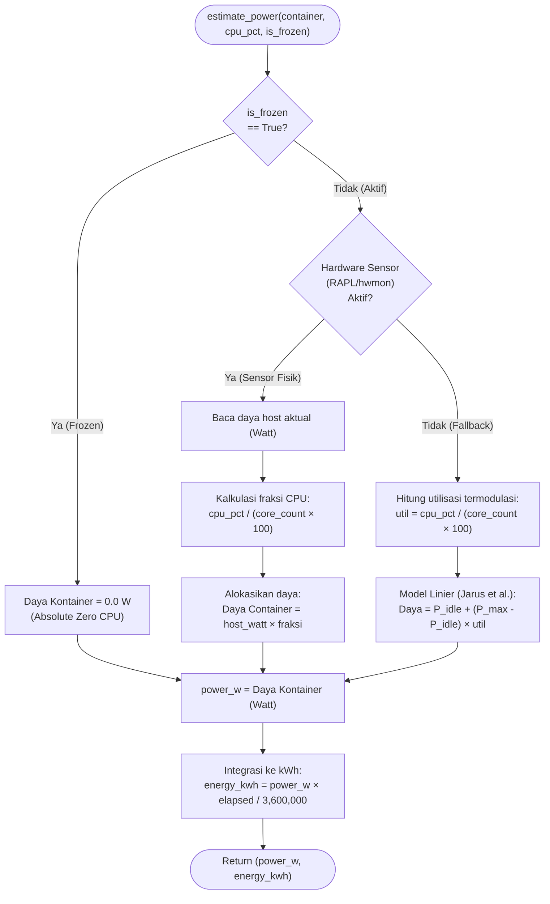
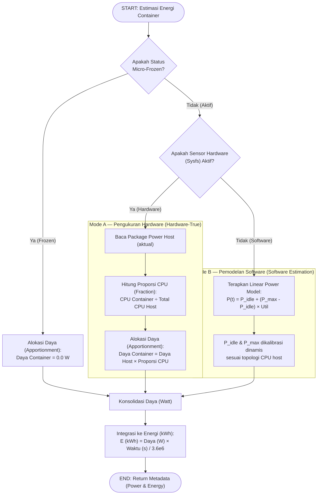

# Flowchart — EnergyEstimator.get_energy() (Supplementary)

> **Kode Sumber:** `framework/energy.py` → class `EnergyEstimator`, fungsi `get_container_energy()` (baris 30–75)
> **Posisi di Diagram:** Supplementary Services → Estimator Konsumsi Daya
> **Kategori:** 🌟 INOVASI ALGORITMA (S2)

Algoritma hibrida cerdas (Smart Hybrid Model) yang dapat menukar metode pengukuran daya (fisik vs estimasi perangkat lunak) secara dinamis. Dilengkapi dengan **Tier-Aware Accounting** di mana container yang sedang dalam state Micro-Frozen berkontribusi persis 0W, secara akurat merepresentasikan penghematan daya CPU riil.

## Mengapa Ini Inovasi S2?

1. **Hybrid Adaptive Model:** Secara otomatis mendeteksi dan memilih mode terbaik (hardware atau software) tanpa konfigurasi manual.
2. **Tier-Aware Zero Accounting:** Kontainer yang di-freeze oleh Micro-Freezer (Tier 0) tidak menggunakan porsi daya idle host (`0W`). Ini secara drastis memperlihatkan celah efisiensi HECF vs Default Docker saat traffic bursty.
3. **Proportional Power Apportionment:** Sensor hardware hanya melaporkan total daya CPU package. Algoritma ini secara matematis membagi total tersebut ke setiap container berdasarkan proporsi penggunaan CPU mereka.

---

## Alur Logika Konseptual

